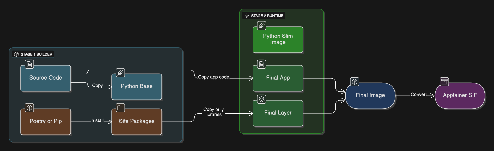
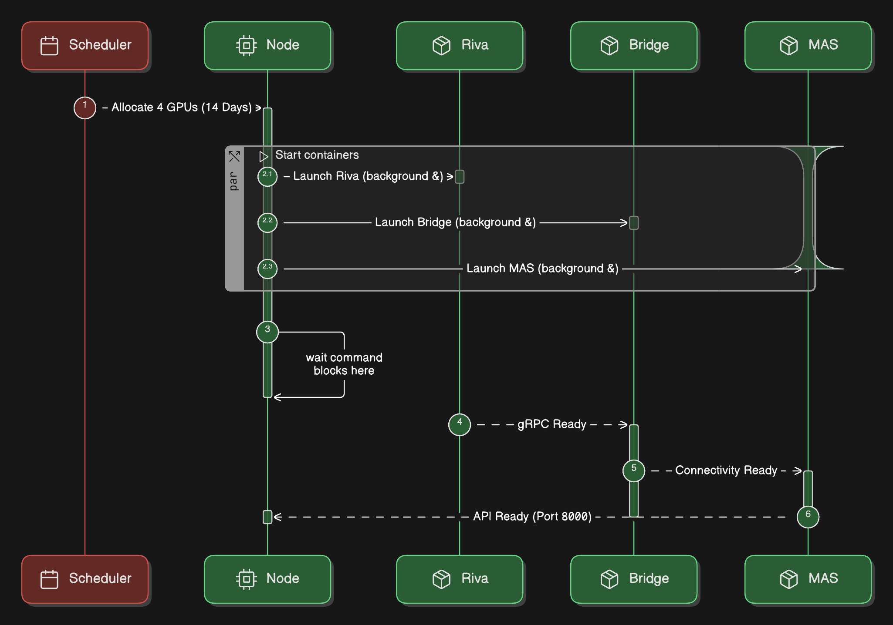

# SPARC Containerization and Deployment

## 1.0 Introduction
This notebook covers the final phase: packaging the SPARC backend into portable containers and deploying them to HiPerGator with a robust networking bridge.

### 1.1 Objectives
1. **Containerize**: Create Dockerfiles for the Multi-Agent System (MAS).
2. **Bridge**: Configure the WebSocket-to-gRPC bridge for Unity connectivity.
3. **Deploy**: Generate production SLURM scripts for HiPerGator.

### 1.2 Introduction Diagram


Introduction: This section sets the objectives for packaging and deploying the backend. The goal is to containerize the Multi-Agent System (MAS), configure the WebSocket-to-gRPC bridge for Unity connectivity, and generate robust production SLURM scripts for deployment to HiPerGator.

---

## 2.0 Containerization (Docker -> Apptainer)
We develop with Docker/Podman and deploy with Apptainer on HPC.

### 2.0 Container Build Strategy Diagram


Container Build Strategy: This flow shows the Multi-Stage Build strategy used to create secure and small containers. A "Builder" stage installs dependencies from `requirements.txt` using `pip`, and then only the necessary artifacts are copied over to a slim "Runtime" stage. This excludes compiler tools and cache files from the final production image.

### 2.1 Dockerfile Definition

This script creates a `Dockerfile.mas` for the Multi-Agent System. We uses a multi-stage build strategy:
1. **Builder Stage**: Installs dependencies from `requirements.txt` using `pip`.
2. **Runtime Stage**: Copies only the installed packages to a lightweight `python:3.11-slim` image. This minimizes the container size and attack surface.

### 2.2 Dockerfile for Multi-Agent System (MAS)

**Note on Conda vs Containers**: On HiPerGator, you can deploy using either:
1. **Conda environments** (simpler, recommended for most cases)
2. **Apptainer containers** (for complex dependencies or portability)

For PubApps deployment, conda environments are preferred per UF RC guidance.

This Dockerfile is provided for reference if containerization is needed:

```python
# 2.2 Dockerfile for Multi-Agent System (MAS)
# NOTE: For HiPerGator training, use conda environments instead (see environment_backend.yml)
# This is primarily for local development or when containers are explicitly required

import os

def create_requirements_file():
    """Writes canonical pip dependency artifact used by Dockerfile.mas."""
    requirements = """
fastapi
uvicorn[standard]
pydantic>=2.5.0
numpy>=1.24.0
aiofiles
websockets
python-multipart
transformers>=4.36.0
accelerate>=0.25.0
tokenizers>=0.15.0
bitsandbytes>=0.41.0
peft>=0.7.0
langchain>=0.1.0
langchain-community>=0.0.13
langchain-openai>=0.0.5
langchain-chroma>=0.1.0
langgraph>=0.0.26
nvidia-riva-client>=2.14.0
nemoguardrails>=0.5.0
chromadb>=0.4.22
presidio-analyzer>=2.2.33
presidio-anonymizer>=2.2.33
firebase-admin>=6.2.0
python-jose[cryptography]
python-dotenv
grpcio
grpcio-tools
""".strip()
    with open("requirements.txt", "w", encoding="utf-8") as f:
        f.write(requirements + "\n")
    print("Created requirements.txt")

def create_dockerfile():
    if not os.path.exists("requirements.txt"):
        raise FileNotFoundError("requirements.txt not found. Run create_requirements_file() first.")

    dockerfile_content = """
# --- Build Stage ---
FROM python:3.11-slim as builder
WORKDIR /app

# Install system dependencies
RUN apt-get update && apt-get install -y --no-install-recommends \
    build-essential \
    curl \
    && rm -rf /var/lib/apt/lists/*

# Install Python dependencies
COPY requirements.txt ./
RUN pip install --no-cache-dir -r requirements.txt

COPY . .

# --- Runtime Stage ---
FROM python:3.11-slim
WORKDIR /app

# Install runtime dependencies only
RUN apt-get update && apt-get install -y --no-install-recommends \
    curl \
    && rm -rf /var/lib/apt/lists/*

COPY --from=builder /usr/local/lib/python3.11/site-packages /usr/local/lib/python3.11/site-packages
COPY --from=builder /app /app

EXPOSE 8000
CMD ["uvicorn", "main:app", "--host", "0.0.0.0", "--port", "8000"]
    """
    with open("Dockerfile.mas", "w", encoding="utf-8") as f:
        f.write(dockerfile_content.strip())
    print("Created Dockerfile.mas")
    print("\nFor HiPerGator/PubApps deployment, conda environments are preferred.")
    print("See environment_backend.yml and setup_conda_env.sh")

create_requirements_file()
create_dockerfile()
```

---

## 3.0 Local Development with Podman
Podman allows creating a 'pod' to simulate the production network namespace.

### 3.0 Local Development Pod Diagram


Local Development Pod (Podman): This illustrates the local development environment using Podman Pods. Unlike standard Docker containers which are isolated, a "Pod" shares a network namespace (localhost). This allows the Riva Server, WebSocket Bridge, and MAS (Multi-Agent System) to communicate locally, perfectly simulating the production environment on a developer's machine.

### 3.1 Podman Local Workflow

For local development, **Podman** is preferred over Docker because it allows us to create a **Pod**. A Pod shares a network namespace (localhost), allowing the separate containers (Riva, Bridge, MAS) to communicate with each other as if they were running on the same machine, mimicking the production environment.

### 3.2 Podman Workflow (Reference Commands)
```python
# 3.1 Podman Workflow (Reference Commands)
# Run these in your local terminal to test interaction between Riva, Bridge, and MAS.

podman_commands = """
# 1. Create Pod
podman pod create --name sparc-backend -p 8080:8080

# 2. Run Riva Server
podman run -d --pod sparc-backend --name riva-server nvcr.io/nvidia/riva/riva-speech:2.16.0-server

# 3. Run WebSocket Bridge
podman run -d --pod sparc-backend --name ws-bridge \
    -e RIVA_API_URL=localhost:50051 \
    riva-websocket-bridge:latest

# 4. Run MAS Server
podman run -d --pod sparc-backend --name mas-server your-repo/mas-server:latest
"""
print(podman_commands)
```

---

## 4.0 Production Deployment on HiPerGator
Deploying persistent services using SLURM and Apptainer.

### 4.0 Production Deployment Diagram


Production Deployment (SLURM): This diagram shows the execution flow of the sparc_production.slurm script on HiPerGator. It details how the SLURM scheduler allocates resources (GPUs) and then launches three concurrent Apptainer containers in the background, keeping them alive with a wait command.

### 4.1 Building SIF Images

HiPerGator uses Apptainer, which requires Singularity Image Format (`.sif`) files. The commands below (commented out) show how to convert your local Docker images into SIF files using `apptainer build`. These files should be stored in the `/blue` directory.

### 4.2 Build SIF Images
```python
# 4.1 Build SIF Images
# !module load apptainer
# !apptainer build mas_server.sif docker-daemon://your-repo/mas-server:latest
# !apptainer build websocket_bridge.sif docker-daemon://riva-websocket-bridge:latest
print("Build SIF images from Docker/Daemon sources before deployment.")
```

### 4.3 Production Service Launch

This function generates the `sparc_production.slurm` script. This is the critical deployment artifact that runs the system on HiPerGator. Key features:
- **Persistent GPUs**: Requests 4 GPUs on the AI partition.
- **Background Processes**: Launches Riva, the Bridge, and the MAS server as background tasks (`&`).
- **Wait Command**: The `wait` instruction keeps the SLURM job alive indefinitely, ensuring the services remain running.
- **Policy-Compliant Runtime**: Uses a finite default (`7-00:00:00`) to avoid scheduler rejection; only use `UNLIMITED` if your partition/QoS explicitly allows it.

### 4.4 Production SLURM Script Generator
```python
# 4.2 Production SLURM Script Generator

def generate_production_script():
    script_content = """
#!/bin/bash
#SBATCH --job-name=sparc-production-service
#SBATCH --partition=hpg-ai
#SBATCH --nodes=1
#SBATCH --gpus-per-task=4
#SBATCH --cpus-per-task=32
#SBATCH --mem=256gb
#SBATCH --time=7-00:00:00
#SBATCH --output=sparc_service_%j.log

module purge
module load apptainer

SPARC_BASE_PATH=${SPARC_BASE_PATH:-/blue/jasondeanarnold/SPARCP}
SPARC_BIND_ROOT=${SPARC_BIND_ROOT:-/blue}
RIVA_SIF=${SPARC_RIVA_SIF:-$SPARC_BASE_PATH/containers/riva_server.sif}
BRIDGE_SIF=${SPARC_BRIDGE_SIF:-$SPARC_BASE_PATH/containers/websocket_bridge.sif}
MAS_SIF=${SPARC_MAS_SIF:-$SPARC_BASE_PATH/containers/mas_server.sif}

# Launch Services in Background
echo "Starting Riva..."
apptainer exec --nv ${RIVA_SIF} riva_start.sh &
sleep 20

echo "Starting Bridge..."
apptainer exec ${BRIDGE_SIF} riva-websocket-gateway --riva-uri=localhost:50051 --port=8080 &

echo "Starting MAS..."
apptainer exec --nv -B $SPARC_BIND_ROOT ${MAS_SIF} uvicorn main:app --host 0.0.0.0 --port 8000 &

wait
    """
    with open("sparc_production.slurm", "w") as f:
        f.write(script_content.strip())
    print("Generated sparc_production.slurm")

generate_production_script()
```

---

## Summary

This notebook provides a complete containerization and deployment workflow for the SPARC backend:

1. **Multi-Stage Docker Build**: Minimizes container size and security vulnerabilities by separating build and runtime stages.

2. **Local Development with Podman**: Uses Podman Pods to create a shared network namespace that simulates the production environment on a developer's machine, allowing all services to communicate via localhost.

3. **Production Deployment on HiPerGator**: 
   - Converts Docker images to Apptainer SIF format for HPC compatibility
   - Uses SLURM job scheduling to allocate GPU resources
   - Launches services as persistent background processes
   - Includes Riva Speech Server, WebSocket-to-gRPC bridge, and Multi-Agent System

4. **Key Components**:
   - **Riva Server**: Handles speech processing tasks
   - **WebSocket Bridge**: Enables communication between Riva and Unity frontend via WebSocket
   - **MAS Server**: Runs the trained agents for handling interactions

The deployment is fully containerized, reproducible, and scalable on HPC infrastructure.
