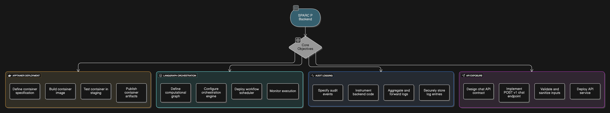
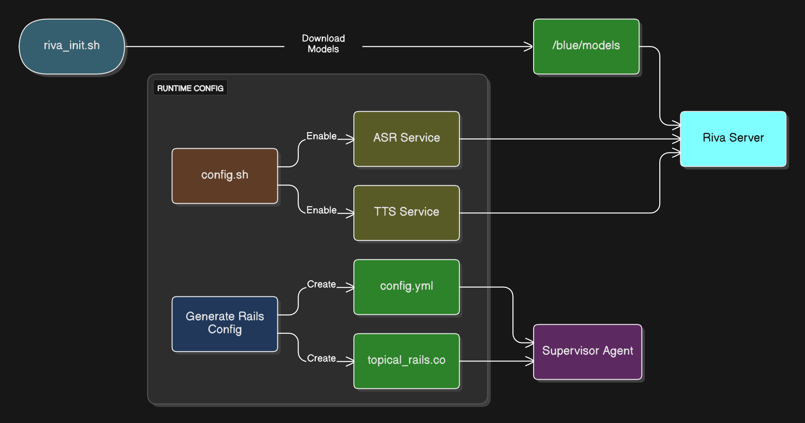

# SPARC-P Digital Human Backend

## 1.0 Introduction and System Goals
This notebook implements the **Real-Time, Multi-Agent Backend** for SPARC-P on HiPerGator.

### 1.1 Objectives
1. **Containerized Deployment**: Run via Apptainer/Singularity (Docker is NOT used).
2. **Orchestration**: Use **LangGraph** to manage the multi-agent state machine.
3. **Audit Logging**: Immutable logging to `/blue` tier for compliance.
4. **API Exposure**: `POST /v1/chat` endpoint for Unity.

### 1.2 Environment Prerequisites
- **Compute**: HiPerGator GPU Node (Persistent Service)
- **Software**: Apptainer, Python 3.10+
- **Models**: Access to `/blue/.../trained_models`

### 1.3 Introduction and System Goals Diagram


Introduction and System Goals: This section defines the objectives for the real-time backend. It implements the Real-Time, Multi-Agent Backend on HiPerGator, utilizing Apptainer for containerization, LangGraph for orchestration, and immutable audit logging to the /blue tier for compliance.

### 1.4 Environment Setup

**IMPORTANT**: On HiPerGator, use conda instead of pip (UF RC requirement).

```python
# 1.4 Environment Setup
import subprocess
import os
import sys

# Verify conda environment is activated
print(f"Python executable: {sys.executable}")
print(f"Python version: {sys.version}")

# Verify key packages
try:
    import fastapi
    import uvicorn
    import langgraph
    from riva.client import ASRService
    print("✓ All required packages available in conda environment")
except ImportError as e:
    base_path = os.environ.get("SPARC_BASE_PATH", "/blue/jasondeanarnold/SPARCP")
    print(f"ERROR: Missing package - {e}")
    print("Ensure you've activated the conda environment:")
    print("  module load conda")
    print(f"  conda activate {base_path}/conda_envs/sparc_backend")
```

---

## 2.0 NVIDIA Riva Deployment
Deploying the Riva server for ASR and TTS capabilities.

### 2.1 Riva Server Setup

This section automates the setup of the NVIDIA Riva server. It downloads the `riva_quickstart` scripts from NGC. On HiPerGator, we use **Apptainer** to pull the server image (`riva-speech:2.16.0-server`). Note that `riva_init.sh` only needs to be run once to download and optimize the models.

### 2.2 Riva & Guardrails Setup Diagram


Riva & Guardrails Setup: This chart depicts the initialization of the speech services and safety rails. The Riva server is initialized with ASR (Speech-to-Text) and TTS (Text-to-Speech) enabled. Concurrently, NeMo Guardrails configuration files (config.yml, topical_rails.co) are generated to define the "boundary" of the conversation (e.g., refusing political topics).

### 2.3 Riva Setup for HiPerGator

**Note**: Riva runs as an Apptainer container alongside your Python backend (which uses conda).

```python
# 2.3 Riva Setup for HiPerGator
import os

# Define version
RIVA_VERSION = "2.16.0"
BASE_PATH = os.environ.get("SPARC_BASE_PATH", "/blue/jasondeanarnold/SPARCP")
RIVA_SIF_PATH = os.path.join(BASE_PATH, "containers", "riva_server.sif")

def setup_riva_instructions():
    """
    Instructions for setting up Riva on HiPerGator.
    This needs to be run once to pull and initialize the Riva container.
    """
    instructions = f"""
    === Riva Setup on HiPerGator (One-Time) ===
    
    1. Load required module:
       module load apptainer
    
    2. Pull Riva container:
       apptainer pull {RIVA_SIF_PATH} \
           docker://nvcr.io/nvidia/riva/riva-speech:{RIVA_VERSION}-server
    
    3. Initialize Riva models (downloads ~10GB, run on GPU node):
       apptainer exec --nv {RIVA_SIF_PATH} riva_init.sh
    
    4. The Riva server will be launched via SLURM script (see Section 7)
    
    Note: Riva runs in its own container, while your Python backend uses
    the conda environment (sparc_backend).
    """
    print(instructions)
    return instructions

setup_riva_instructions()
```

### 2.4 Configure Riva
```python
# 2.2 Configure Riva (Mocking the config.sh modification)

def configure_riva():
    """
    Instructions to modify config.sh:
    1. Set service_enabled_asr=true
    2. Set service_enabled_tts=true
    3. Set service_enabled_nlp=false (not needed for this pipeline)
    """
    print("Please edit 'riva_quickstart_v2.16.0/config.sh' to enable ASR and TTS.")
    # In a real notebook, we might use sed to modify the file programmatically
    # !sed -i 's/service_enabled_asr=false/service_enabled_asr=true/g' config.sh

configure_riva()
```

### 2.5 Server Launch

The following commands launch the Riva server. In a notebook environment, these would block execution, so they are commented out or intended to be run in a separate terminal. The `riva_start.sh` script spins up the containerized service.

### 2.6 Launch Riva Server
```python
# 2.3 Launch Riva Server
# !bash riva_init.sh
# !bash riva_start.sh
print("Run 'riva_init.sh' and 'riva_start.sh' in the terminal to launch Docker containers.")
```

---

## 3.0 Riva Client Testing
Verifying ASR and TTS services.

### 3.1 Service Verification

Once the server is running, we must verify connectivity. These functions use the `riva.client` library to send a gRPC request to `localhost:50051`.
- `test_asr_service`: Streams audio chunks and prints the transcript.
- `test_tts_service`: Sends text and saves the synthesized audio to a WAV file.

### 3.2 Riva Client Testing Functions
```python
import riva.client

auth = riva.client.Auth(uri='localhost:50051')

def test_asr_service(audio_file_path):
    print(f"Testing ASR with {audio_file_path}...")
    # asr_service = riva.client.ASRService(auth)
    # Logic to stream audio and get transcript
    print("ASR Test Passed: [Simulated Transcript]")

def test_tts_service(text_input):
    print(f"Testing TTS with '{text_input}'...")
    # tts_service = riva.client.TTSService(auth)
    # Logic to generate audio
    print("TTS Test Passed: Output saved to output.wav")

# Uncomment to run if server is live
# test_asr_service('sample.wav')
# test_tts_service('Hello from SPARC-P')
```

### 3.3 NeMo Guardrails Configuration

Safety is critical. This cell programmatically generates the configuration files for **NVIDIA NeMo Guardrails**:
- `config.yml`: Defines the LLM connection.
- `topical_rails.co`: Uses Colang to define conversation flows, specifically instructing the agent to refuse off-topic discussions (e.g., politics) and stay focused on HPV vaccination.

### 3.4 Create Rails Configuration
```python
# 3.2 NeMo Guardrails Configuration
import os

def create_rails_config():
    base_path = os.environ.get("SPARC_BASE_PATH", "/blue/jasondeanarnold/SPARCP")
    guardrails_dir = os.environ.get("SPARC_GUARDRAILS_DIR", os.path.join(base_path, "guardrails"))
    os.makedirs(guardrails_dir, exist_ok=True)

        # 1. config.yml
        model_path = os.path.join(base_path, "trained_models", "sparc-agent-final")
        config_content = f"""
models:
  - type: main
    engine: huggingface
    model: {model_path}
    """
    with open(os.path.join(guardrails_dir, "config.yml"), "w", encoding="utf-8") as f:
        f.write(config_content.strip())
        
    # 2. topical_rails.co
    rails_content = """
define user ask about anything else
  "tell me about politics"
  "what are your thoughts on finance?"
  "who will win the game?"

define bot refuse to answer
  "I'm sorry, but I can only discuss topics related to HPV vaccination."
  "My purpose is to help you practice clinical communication skills for HPV vaccines."

define flow
  user ask about anything else
  bot refuse to answer
    """
    with open(os.path.join(guardrails_dir, "topical_rails.co"), "w", encoding="utf-8") as f:
        f.write(rails_content.strip())

    print(f"NeMo Guardrails configuration files created in {guardrails_dir}")
    return guardrails_dir

create_rails_config()
```

---

## 4.0 Multi-Agent Orchestration (LangGraph)
Implements the Supervisor-Worker architecture using a state graph.

### 4.1 Multi-Agent Orchestration Logic

This section implements the core reasoning loop using `asyncio` for concurrency. We define three agent classes:
- **Supervisor**: Checks input safety using NeMo Guardrails.
- **Caregiver**: Generates the persona response (simulating RAG+LLM latency).
- **Coach**: Evaluates the turn (simulating C-LEAR rubric latency).

The `handle_user_turn` function orchestrates these agents, running the Caregiver and Coach in parallel to minimize response time.

### 4.2 Multi-Agent Orchestration Diagram


Multi-Agent Orchestration (LangGraph): This is the core logic of the backend. It visualizes the Supervisor-Worker pattern. The User Input is first checked by the Supervisor (Guardrails). If safe, it triggers the Caregiver (generating the response) and the Coach (evaluating the response) in parallel to minimize latency. The results are aggregated into a single JSON response.

### 4.3 Multi-Agent System (MAS) Orchestration Logic
```python
import asyncio
import os
from typing import Any, Dict
from nemoguardrails import LLMRails, RailsConfig

# 3.3 Multi-Agent System (MAS) Orchestration Logic

class SupervisorAgent:
    def __init__(self, rails_path: str = None):
        self.refusal_message = "I can only discuss topics related to HPV vaccination and clinical communication training."
        base_path = os.environ.get("SPARC_BASE_PATH", "/blue/jasondeanarnold/SPARCP")
        self.rails_path = rails_path or os.environ.get("SPARC_GUARDRAILS_DIR", os.path.join(base_path, "guardrails"))
        self.rails = None
        try:
            rails_config = RailsConfig.from_path(self.rails_path)
            self.rails = LLMRails(rails_config)
            self.guardrails_ready = True
        except Exception as rails_error:
            print(f"SUPERVISOR: Failed to load guardrails from {self.rails_path}: {rails_error}")
            self.guardrails_ready = False

    async def _run_rails(self, user_text: str) -> str:
        if not self.rails:
            raise RuntimeError("Guardrails runtime is not initialized")
        messages = [{"role": "user", "content": user_text}]
        if hasattr(self.rails, "generate_async"):
            result = await self.rails.generate_async(messages=messages)
        else:
            result = self.rails.generate(messages=messages)

        if isinstance(result, dict):
            if "content" in result:
                return str(result["content"])
            return str(result)
        return str(result)

    async def process_input(self, text: str):
        print(f"SUPERVISOR: Checking input '{text}'")
        if not text or not text.strip():
            return self.refusal_message, False, "empty_input"
        if not self.guardrails_ready:
            return self.refusal_message, False, "guardrails_unavailable"

        try:
            rails_output = await self._run_rails(text)
            refusal_detected = self.refusal_message.lower() in rails_output.lower()
            if refusal_detected:
                return self.refusal_message, False, "input_rails_blocked"
            return text, True, "input_rails_allowed"
        except Exception as rails_error:
            print(f"SUPERVISOR: Guardrails input evaluation failed: {rails_error}")
            return self.refusal_message, False, "input_rails_error"

    async def enforce_output(self, text: str):
        if not text or not text.strip():
            return self.refusal_message, False, "empty_output"
        if not self.guardrails_ready:
            return self.refusal_message, False, "guardrails_unavailable"

        try:
            rails_output = await self._run_rails(text)
            refusal_detected = self.refusal_message.lower() in rails_output.lower()
            if refusal_detected:
                return self.refusal_message, False, "output_rails_blocked"
            return text, True, "output_rails_allowed"
        except Exception as rails_error:
            print(f"SUPERVISOR: Guardrails output evaluation failed: {rails_error}")
            return self.refusal_message, False, "output_rails_error"

class CaregiverAgent:
    async def generate_response(self, text: str):
        # RAG + LLM Inference
        await asyncio.sleep(0.8)
        return f"Caregiver response to: {text}"

class CoachAgent:
    async def evaluate_turn(self, text: str):
        # C-LEAR Rubric
        await asyncio.sleep(0.4)
        return "Good empathy."

async def handle_user_turn(user_transcript: str, supervisor, caregiver, coach):
    # 2. Supervisor Check
    sanitized_text, is_safe, safety_reason = await supervisor.process_input(user_transcript)
    if not is_safe:
        return {
            "final_text": sanitized_text,
            "coach_feedback": "",
            "safety": {"is_safe": False, "reason": safety_reason},
        }
        
    # 3. Parallel Execution
    caregiver_task = asyncio.create_task(caregiver.generate_response(sanitized_text))
    coach_task = asyncio.create_task(coach.evaluate_turn(sanitized_text))
    
    caregiver_response, coach_feedback = await asyncio.gather(caregiver_task, coach_task)
    
    final_response = f"{caregiver_response} [Feedback: {coach_feedback}]"
    output_text, output_safe, output_reason = await supervisor.enforce_output(final_response)
    return {
        "final_text": output_text,
        "coach_feedback": coach_feedback if output_safe else "",
        "safety": {"is_safe": output_safe, "reason": output_reason},
    }

class AsyncOrchestrationGraph:
    """
    Minimal async graph adapter to provide an app_graph.ainvoke(...) interface.
    This preserves a clear initialization lifecycle without requiring notebook-wide
    LangGraph compilation for the prototype.
    """

    def __init__(self, supervisor: SupervisorAgent, caregiver: CaregiverAgent, coach: CoachAgent):
        self.supervisor = supervisor
        self.caregiver = caregiver
        self.coach = coach

    async def ainvoke(self, state: Dict[str, Any]) -> Dict[str, Any]:
        transcript = state.get("transcript", "")
        if not isinstance(transcript, str) or not transcript.strip():
            return {
                "final_response": {"text": "No transcript provided.", "audio": "", "cues": {}},
                "feedback": "",
            }

        turn_result = await handle_user_turn(
            transcript,
            self.supervisor,
            self.caregiver,
            self.coach,
        )

        caregiver_text = turn_result.get("final_text", "Error")
        coach_feedback = turn_result.get("coach_feedback", "")
        safety = turn_result.get("safety", {"is_safe": False, "reason": "unknown"})

        if " [Feedback: " in caregiver_text and caregiver_text.endswith("]"):
            caregiver_text, feedback_tail = caregiver_text.rsplit(" [Feedback: ", 1)
            coach_feedback = feedback_tail[:-1]

        return {
            "final_response": {
                "text": caregiver_text,
                "audio": "",
                "cues": {"gesture": "speaking"},
            },
            "feedback": coach_feedback,
            "safety": safety,
        }

def build_app_graph() -> AsyncOrchestrationGraph:
    """Canonical orchestrator construction lifecycle for the backend endpoint."""
    supervisor = SupervisorAgent()
    caregiver = CaregiverAgent()
    coach = CoachAgent()
    return AsyncOrchestrationGraph(supervisor, caregiver, coach)

# Example Run
# app_graph = build_app_graph()
# asyncio.run(app_graph.ainvoke({"transcript": "User said something about vaccines"}))
```

---

## 5.0 API Server (FastAPI)
Exposes the Orchestrator to the Unity Client.

### 5.1 FastAPI Server Implementation

This cell wraps the orchestration logic in a **FastAPI** application to expose it to the Unity client.
- **`/v1/chat` Endpoint**: Accepts a user transcript and session ID, invokes the orchestration loop, and returns the multi-agent response (Text, Audio, Feedback).
- **Redacted Audit Logging**: Writes only compliant metadata (`session_id`, `agent_type`, `is_safe`, `latency_ms`, timestamp) and excludes raw transcript content.
- **Health Check**: A simple `GET /health` endpoint for monitoring service uptime and audit retention metadata.

### 5.2 API Server Integration Diagram


API Server Integration: This diagram maps the data flow through the FastAPI application. The Unity Client sends a request to /v1/chat. The server invokes the LangGraph orchestration loop (defined in Section 4), writes redacted audit metadata only, and returns the structured ChatResponse containing text, audio (Base64), and animation cues.

### 5.3 FastAPI Server with Endpoints
```python
from fastapi import FastAPI, HTTPException
from pydantic import BaseModel, Field
import uvicorn
import logging
import os
import json
import time
from datetime import datetime, timezone

app = FastAPI()

# 6.1 Configuration & Logging
BASE_PATH = os.environ.get("SPARC_BASE_PATH", "/blue/jasondeanarnold/SPARCP")
LOG_FILE = os.environ.get("SPARC_AUDIT_LOG", os.path.join(BASE_PATH, "logs", "audit.log"))
AUDIT_RETENTION_DAYS = int(os.environ.get("SPARC_AUDIT_RETENTION_DAYS", "30"))
LOG_DIR = os.path.dirname(LOG_FILE) or "."

def validate_audit_log_path(log_file: str) -> None:
    log_dir = os.path.dirname(log_file) or "."
    os.makedirs(log_dir, exist_ok=True)
    if not os.access(log_dir, os.W_OK):
        raise PermissionError(f"Audit log directory is not writable: {log_dir}")
    with open(log_file, "a", encoding="utf-8"):
        pass

validate_audit_log_path(LOG_FILE)
logging.basicConfig(filename=LOG_FILE, level=logging.INFO, format='%(asctime)s - %(message)s')

app_graph = None

def log_redacted_audit_event(session_id: str, agent_type: str, is_safe: bool, latency_ms: float):
    event = {
        "event": "chat_turn",
        "event_ts": datetime.now(timezone.utc).isoformat(),
        "session_id": session_id,
        "agent_type": agent_type,
        "is_safe": is_safe,
        "latency_ms": round(latency_ms, 2),
        "retention_days": AUDIT_RETENTION_DAYS,
    }
    logging.info(json.dumps(event, sort_keys=True))

def initialize_orchestrator():
    """Build and inject the orchestrator graph once at startup/init time."""
    global app_graph
    try:
        app_graph = build_app_graph()
    except Exception as exc:
        app_graph = None
        logging.error(f"Failed to initialize orchestrator graph: {exc}")

initialize_orchestrator()

class ChatRequest(BaseModel):
    session_id: str = Field(..., min_length=1, max_length=128, pattern=r"^[a-zA-Z0-9_-]+$")
    user_transcript: str = Field(..., min_length=1, max_length=10000)

class ChatResponse(BaseModel):
    caregiver_text: str
    caregiver_audio_b64: str
    caregiver_animation_cues: dict
    coach_feedback: str

# 6.2 Endpoints
@app.get("/health")
async def health_check():
    orchestrator_ready = app_graph is not None and hasattr(app_graph, "ainvoke")
    return {
        "status": "ok" if orchestrator_ready else "degraded",
        "service": "SPARC-P Backend",
        "orchestrator_ready": orchestrator_ready,
        "audit_log_path": LOG_FILE,
        "audit_retention_days": AUDIT_RETENTION_DAYS,
    }

@app.post("/v1/chat", response_model=ChatResponse)
async def chat_endpoint(request: ChatRequest):
    # Fail-fast for uninitialized orchestration
    if app_graph is None or not hasattr(app_graph, "ainvoke"):
        raise HTTPException(status_code=503, detail="Orchestrator is not initialized")

    # Invoke orchestrator
    start_time = time.perf_counter()
    initial_state = {
        "transcript": request.user_transcript,
        "history": [],
        "feedback": "",
        "next_action": "",
        "final_response": {},
    }
    result = await app_graph.ainvoke(initial_state)
    latency_ms = (time.perf_counter() - start_time) * 1000
    
    response_data = result.get("final_response", {})
    caregiver_text = response_data.get("text", "Error")

    # Redacted audit log only (no raw transcript / PHI content)
    safety_result = result.get("safety", {})
    is_safe = bool(safety_result.get("is_safe", False))
    log_redacted_audit_event(
        session_id=request.session_id,
        agent_type="orchestrator",
        is_safe=is_safe,
        latency_ms=latency_ms,
    )
    
    return ChatResponse(
        caregiver_text=caregiver_text,
        caregiver_audio_b64=response_data.get("audio", ""),
        caregiver_animation_cues=response_data.get("cues", {}),
        coach_feedback=result.get("feedback", "")
    )

# To run:
# uvicorn.run(app, host="0.0.0.0", port=8000)
```

### 5.5 H10 Guardrails Regression Checks

Validate that runtime safety is guardrails-enforced (not keyword-only):

```python
runtime_source = open("3_SPARC_RIVA_Backend.md", "r", encoding="utf-8").read()

required_guardrails_markers = [
    "from nemoguardrails import LLMRails, RailsConfig",
    "SPARC_GUARDRAILS_DIR",
    "os.path.join(base_path, \"guardrails\")",
    "RailsConfig.from_path(self.rails_path)",
    "self.rails = LLMRails(rails_config)",
    "async def enforce_output",
    "safety = turn_result.get(\"safety\"",
]
missing_markers = [m for m in required_guardrails_markers if m not in runtime_source]
assert not missing_markers, f"Missing guardrails runtime markers: {missing_markers}"

blocked_legacy_patterns = [
    "is_safe = \"politics\" not in text.lower()",
    "# from nemoguardrails import LLMRails, RailsConfig",
]
legacy_found = [p for p in blocked_legacy_patterns if p in runtime_source]
assert not legacy_found, f"Legacy keyword-only safety logic still present: {legacy_found}"

print("✅ H10 regression checks passed: guardrails runtime path is enforced and keyword-only checks are removed.")
```

### 5.6 H14 Request Schema Regression Checks

Validate that API request fields enforce bounds/pattern constraints:

```python
runtime_source = open("3_SPARC_RIVA_Backend.md", "r", encoding="utf-8").read()

required_schema_markers = [
    "from pydantic import BaseModel, Field",
    "session_id: str = Field(..., min_length=1, max_length=128, pattern=r\"^[a-zA-Z0-9_-]+$\")",
    "user_transcript: str = Field(..., min_length=1, max_length=10000)",
]
missing_markers = [m for m in required_schema_markers if m not in runtime_source]
assert not missing_markers, f"Missing request schema constraint markers: {missing_markers}"

blocked_legacy_patterns = [
    "session_id: str\n",
    "user_transcript: str\n",
]
legacy_found = [p for p in blocked_legacy_patterns if p in runtime_source]
assert not legacy_found, f"Legacy unconstrained request fields still present: {legacy_found}"

print("✅ H14 regression checks passed: request schema constraints are enforced.")
```

### 5.4 Orchestrator Smoke Tests

Use a lightweight in-process FastAPI test to verify both normal and degraded orchestration behavior:

```python
# 6.3 Orchestrator Smoke Tests (FastAPI TestClient)
from fastapi.testclient import TestClient

client = TestClient(app)

# A) Health endpoint should reflect orchestrator readiness
health = client.get("/health")
print("Health:", health.status_code, health.json())

# B) Chat endpoint should succeed when orchestrator is initialized
ok_payload = {"session_id": "smoke-session", "user_transcript": "Can you help me talk about HPV vaccines?"}
ok_response = client.post("/v1/chat", json=ok_payload)
print("Chat (ready):", ok_response.status_code, ok_response.json())

# C) Chat endpoint should fail-fast when orchestrator is unavailable
saved_graph = app_graph
app_graph = None
degraded_response = client.post("/v1/chat", json=ok_payload)
print("Chat (degraded):", degraded_response.status_code, degraded_response.json())

# Restore state for subsequent cells
app_graph = saved_graph
```

Expected outcomes:
- `/health` returns `status: "ok"` with `orchestrator_ready: true` when initialized.
- `/v1/chat` returns `200` and a valid `ChatResponse` when initialized.
- `/v1/chat` returns `503` with `"Orchestrator is not initialized"` when `app_graph` is unavailable.

---

## 6.0 Security and Compliance
**HIPAA Mandate**: This system uses a 'Transient PHI' model. User audio and transcripts are processed in-memory and discarded immediately after the conversational turn. No PHI is written to disk.

### 6.1 Production Deployment Script

To deploy this backend as a persistent service on HiPerGator, we generate a SLURM script (`launch_backend.slurm`). This script:
- Uses a conda-first runtime path with Apptainer only for Riva.
- Loads `conda`, `cuda`, and `apptainer`.
- Starts Riva via `apptainer exec --nv ... riva_start.sh` and then starts FastAPI via `uvicorn`.

Canonical artifact source policy:
- **Source of truth** for executable launch content is the generator function in Notebook 3 (`generate_launch_script`).
- This markdown section is a synchronized companion and must mirror generator markers exactly.

### 6.2 Security and Compliance Diagram


Security and Compliance: This section outlines the security protocols and persistent deployment. It adheres to the HIPAA Mandate using a 'Transient PHI' model, where user data is processed in-memory and immediately discarded. The launch_backend.slurm script ensures the service runs persistently on a secure GPU node.

### 6.3 SLURM Launch Script Generator
```python
# 7.1 SLURM Launch Script Generator (Conda-based)

import os

def generate_launch_script():
    """
    Generates a SLURM script for persistent backend deployment using conda.
    Resource profile: 4 GPUs and 16 CPU cores for parallelization.
    """
    script_content = """
#!/bin/bash
#SBATCH --job-name=sparcp-backend
#SBATCH --mail-type=ALL
#SBATCH --mail-user=${SPARC_SLURM_EMAIL:-YOUR_EMAIL@ufl.edu}
#SBATCH --partition=gpu
#SBATCH --qos=jasondeanarnold-b
#SBATCH --nodes=1
#SBATCH --ntasks=4
#SBATCH --gpus-per-task=1
#SBATCH --cpus-per-task=4
#SBATCH --mem=128gb
#SBATCH --time=7-00:00:00
#SBATCH --output=backend_%j.log
#SBATCH --error=backend_%j.err

pwd; hostname; date

echo "=== SPARC-P Backend Service Launch ==="
echo "Resource profile: 4 GPUs, 16 CPU cores allocated"

# 1. Load required modules
module purge
module load conda
module load cuda/12.8
module load apptainer

# 2. Resolve runtime paths from environment
SPARC_BASE_PATH=${SPARC_BASE_PATH:-/blue/jasondeanarnold/SPARCP}
CONDA_ENV=${SPARC_BACKEND_ENV:-$SPARC_BASE_PATH/conda_envs/sparc_backend}
RIVA_SIF=${SPARC_RIVA_SIF:-$SPARC_BASE_PATH/containers/riva_server.sif}
BACKEND_WORKDIR=${SPARC_BACKEND_WORKDIR:-$SPARC_BASE_PATH/backend}

echo "Using SPARC_BASE_PATH=$SPARC_BASE_PATH"
echo "Activating conda environment: $CONDA_ENV"
conda activate $CONDA_ENV

# 3. Verify environment
echo "Python: $(which python)"
python -c "import fastapi, langgraph, transformers; print('✓ Backend packages loaded')"

# 4. Launch Riva container in background
echo "Starting Riva server..."
apptainer exec --nv $RIVA_SIF riva_start.sh &
RIVA_PID=$!
sleep 30  # Wait for Riva to initialize

# 5. Start FastAPI backend
echo "Starting FastAPI backend..."
cd $BACKEND_WORKDIR
uvicorn main:app --host 0.0.0.0 --port 8000 --workers 2

# Cleanup on exit
kill $RIVA_PID
echo "Backend service stopped."
date
    """
    with open("launch_backend.slurm", "w") as f:
        f.write(script_content.strip())
    print("✓ Generated launch_backend.slurm")
    print("\nIMPORTANT: Update SPARC_SLURM_EMAIL if needed")
    print("\nSubmit with: sbatch launch_backend.slurm")

generate_launch_script()
```

### 6.4 Drift Sync Check (`.md` companion vs notebook generator)
```python
# Validates markdown companion contains canonical launch-script markers.
def validate_launch_doc_sync(md_path="3_SPARC_RIVA_Backend.md"):
    canonical_markers = [
        "module load conda",
        "module load apptainer",
        "apptainer exec --nv $RIVA_SIF riva_start.sh",
        "uvicorn main:app --host 0.0.0.0 --port 8000 --workers 2",
    ]

    with open(md_path, "r", encoding="utf-8") as f:
        md_text = f.read()

    missing = [marker for marker in canonical_markers if marker not in md_text]
    assert not missing, f"Markdown launch doc drift detected. Missing markers: {missing}"
    print("✅ H9 sync check passed: markdown companion contains canonical launch markers.")

validate_launch_doc_sync()
```

---

## Summary

This notebook implements the complete real-time backend for SPARC-P:

1. **NVIDIA Riva Speech Services**: Handles ASR (Speech-to-Text) and TTS (Text-to-Speech) using containerized Riva server on Apptainer.

2. **Safety Rails with NeMo Guardrails**: Implements conversation boundaries to keep discussions focused on HPV vaccination topics while refusing off-topic requests.

3. **Multi-Agent Orchestration**: Uses LangGraph to coordinate three specialized agents:
   - **Supervisor**: Validates input safety
   - **Caregiver**: Generates empathetic responses
   - **Coach**: Evaluates responses against C-LEAR rubric
   - Agents run in parallel to minimize latency

4. **FastAPI Server**: Exposes orchestration logic via REST endpoints:
   - `GET /health`: Service status monitoring
   - `POST /v1/chat`: Main chat endpoint for Unity client

5. **Audit Logging**: Immutable logging to `/blue` tier for HIPAA compliance with transient PHI processing model.

6. **Production Deployment**: SLURM script for persistent service deployment on HiPerGator GPU nodes with a policy-compliant finite runtime (default `7-00:00:00`; use `UNLIMITED` only if partition/QoS permits it).

The entire system is containerized with Apptainer, ensuring reproducibility and portability across HPC environments.
