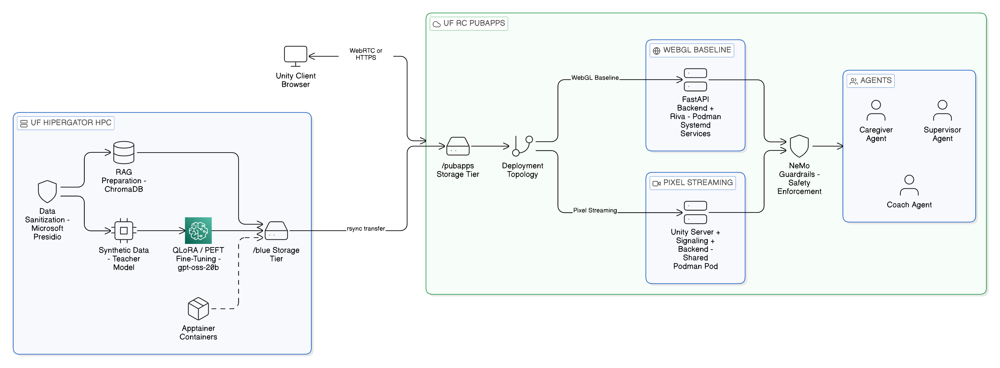
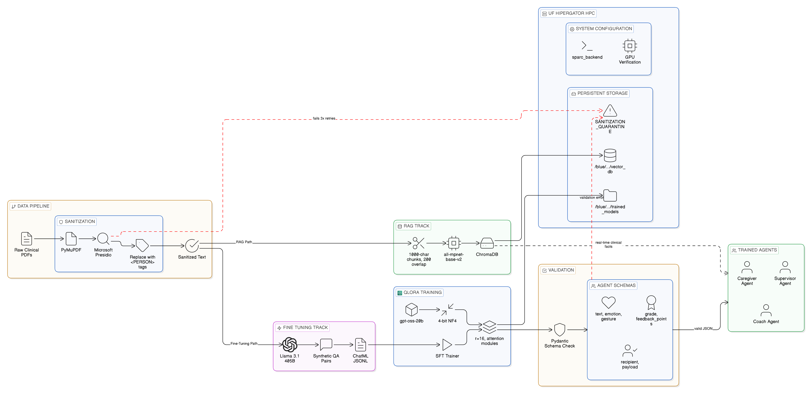
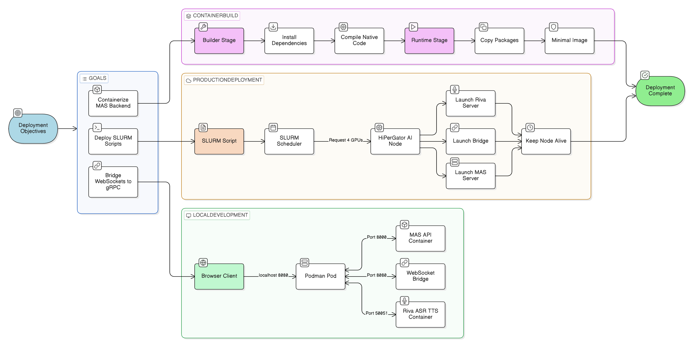
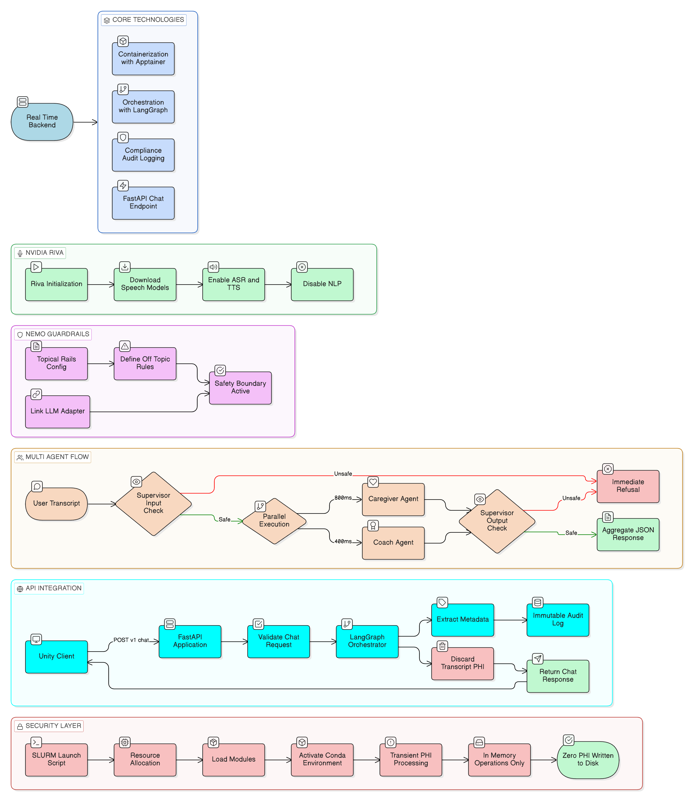

# SPARC-P: Standardized Patient Avatar for Reflective Communication Practice


SPARC-P is a multi-agent digital human training platform for clinician communication practice. This repository is the operational notebook and documentation workspace for training, backend orchestration, and deployment across UF HiPerGator and UF PubApps.

It is designed to be the implementation companion to the Unity client stack and focuses on model training, speech pipeline integration, runtime safety, API behavior, and deployment operations.

---

## Current Project Baseline (February 2026)

This repository follows a conda-first UF RC workflow and includes hardening updates across runtime, API, and deployment paths.

### Core outcomes now reflected in the notebooks and guides

- Conda is the canonical environment path for training and backend execution on UF infrastructure.
- Training execution handoff is notebook-driven (`nbconvert` path) instead of relying on missing standalone script artifacts.
- API contract alignment is standardized around a canonical v1 shape and shared request/response expectations.
- Runtime security posture now includes in-app auth guard support, trusted-origin CORS strategy, and enforced guardrails flow.
- Operational resilience includes readiness-aware health semantics, async offloading for blocking generation paths, and bounded audio delivery patterns.

For detailed implementation evidence and issue-level traceability, see [v1/QUALITY_REVIEW_BACKLOG.md](v1/QUALITY_REVIEW_BACKLOG.md) and [v1/IMPLEMENTATION_SUMMARY.md](v1/IMPLEMENTATION_SUMMARY.md).

---

## Quick Links

### Active (v2)

- [v2/README.md](v2/README.md) — v2 notebook test/deployment index
- [v2/H1_Model_Fine_Tuning_PyTorch.ipynb](v2/H1_Model_Fine_Tuning_PyTorch.ipynb) — fine-tuning workflow
- [v2/H2_Agent_Testing_Chatbot.ipynb](v2/H2_Agent_Testing_Chatbot.ipynb) — chatbot/agent validation
- [v2/H3_Riva_Testing_Speech.ipynb](v2/H3_Riva_Testing_Speech.ipynb) — Riva speech testing
- [v2/H4_Nemo_Testing_Security.ipynb](v2/H4_Nemo_Testing_Security.ipynb) — guardrails and safety testing
- [v2/P1_PubApp_WebGL_Deployment.ipynb](v2/P1_PubApp_WebGL_Deployment.ipynb) — WebGL deployment path
- [v2/P2_PubApp_Linux_Deployment.ipynb](v2/P2_PubApp_Linux_Deployment.ipynb) — Linux deployment path
- [v2/P3_PubApp_Load_Testing.ipynb](v2/P3_PubApp_Load_Testing.ipynb) — load and capacity testing

### Legacy (v1 reference docs)

- [v1/MIGRATION_GUIDE.md](v1/MIGRATION_GUIDE.md) — conda migration/environment guidance
- [v1/API_DOCUMENTATION.md](v1/API_DOCUMENTATION.md) — canonical API reference history
- [v1/1_SPARC_Agent_Training.md](v1/1_SPARC_Agent_Training.md) through [v1/4b_SPARC_PubApp_Deployment_PixelStreaming.md](v1/4b_SPARC_PubApp_Deployment_PixelStreaming.md) — original notebook companion docs

---

## What This Repository Contains

This repository now has two notebook generations:

- **`v2/` (active):** current implementation and test notebooks used for development, validation, deployment, and automated scenario testing.
- **`v1/` (legacy/reference):** original notebook + markdown set retained for historical traceability and migration context.

Current execution and testing should target **v2**.

---

## Architecture Overview

### Functional roles

- **Caregiver agent**: Simulated caregiver interaction and persona behavior.
- **Coach agent**: Communication performance feedback and rubric-oriented coaching.
- **Supervisor agent**: Orchestration, safety policy routing, and final response assembly.

### Platform split

- **HiPerGator**: Training, dataset processing, model adaptation, backend validation workflows.
- **PubApps**: Persistent serving, reverse proxy/public access, and production runtime services.

### Primary technology stack

- **Model adaptation**: QLoRA + PEFT workflows
- **RAG**: Chroma-based vector retrieval pipeline
- **Speech**: NVIDIA Riva ASR/TTS integration
- **Safety**: NeMo Guardrails runtime checks
- **API**: FastAPI backend with typed request/response contracts
- **Containers**:
  - HiPerGator: Apptainer for selected workflows
  - PubApps: Podman and systemd user services

---

## Notebook and Document Map

### v2 (active notebooks)

- **H-series (development + validation):**
  - [v2/H1_Model_Fine_Tuning_PyTorch.ipynb](v2/H1_Model_Fine_Tuning_PyTorch.ipynb)
  - [v2/H2_Agent_Testing_Chatbot.ipynb](v2/H2_Agent_Testing_Chatbot.ipynb)
  - [v2/H3_Riva_Testing_Speech.ipynb](v2/H3_Riva_Testing_Speech.ipynb)
  - [v2/H4_Nemo_Testing_Security.ipynb](v2/H4_Nemo_Testing_Security.ipynb)
  - [v2/H5_Caregiver_Test_Scenarios.ipynb](v2/H5_Caregiver_Test_Scenarios.ipynb)
  - [v2/H6_Coach_Test_Scenarios.ipynb](v2/H6_Coach_Test_Scenarios.ipynb)
  - [v2/H7_Supervisor_Test_Scenarios.ipynb](v2/H7_Supervisor_Test_Scenarios.ipynb)
  - [v2/H8_Edge_Case_Test_Scenarios.ipynb](v2/H8_Edge_Case_Test_Scenarios.ipynb)
  - [v2/H9_Container_Tests_WebGL_and_Linux.ipynb](v2/H9_Container_Tests_WebGL_and_Linux.ipynb)

- **P-series (deployment + operational testing):**
  - [v2/P1_PubApp_WebGL_Deployment.ipynb](v2/P1_PubApp_WebGL_Deployment.ipynb)
  - [v2/P2_PubApp_Linux_Deployment.ipynb](v2/P2_PubApp_Linux_Deployment.ipynb)
  - [v2/P3_PubApp_Load_Testing.ipynb](v2/P3_PubApp_Load_Testing.ipynb)
  - [v2/P4_Test_Session_1_Automated_Test.ipynb](v2/P4_Test_Session_1_Automated_Test.ipynb)
  - [v2/P5_Test_Session_2_Automated_Test.ipynb](v2/P5_Test_Session_2_Automated_Test.ipynb)

### v1 (legacy reference)

- Original notebook + markdown workflow docs retained under [v1/](v1/).

---

## Architecture Diagrams by Notebook

High-Level SPARC-P Platform Architecture


Agent Training Pipeline Architecture


Containerization and Deployment Flow


Real Time Backend Architecture

---

## Environment and Dependency Model

### Canonical environments

- [environment_training.yml](environment_training.yml): Training and adaptation environment
- [environment_backend.yml](environment_backend.yml): Backend and serving-oriented environment
- [setup_conda_env.sh](setup_conda_env.sh): Automated conda environment setup helper

### Dependency artifacts

- [requirements.txt](requirements.txt) is used where container build workflows require pip-based dependency resolution.
- Conda remains the canonical host/runtime environment path for UF RC workflows.

For migration guidance and compatibility notes, see [v1/MIGRATION_GUIDE.md](v1/MIGRATION_GUIDE.md).

---

## End-to-End Workflow

### Phase 1 — Train and validate on HiPerGator

1. Prepare conda environments using [setup_conda_env.sh](setup_conda_env.sh) or manual conda creation from environment files.
2. Execute H-series notebooks in `v2` (`H1` → `H4`) for adaptation, agent testing, speech, and safety validation.
3. Execute scenario test notebooks (`H5`–`H8`) for caregiver/coach/supervisor/edge-case validation.
4. Execute `H9` for container test coverage before deployment.

### Phase 2 — Deploy to PubApps

1. Provision PubApps resources and complete required UF RC risk/compliance steps.
2. Transfer trained model artifacts from HiPerGator storage to PubApps storage.
3. Stand up runtime services (Riva/backend and related support services) using `v2` deployment notebooks:
  - [v2/P1_PubApp_WebGL_Deployment.ipynb](v2/P1_PubApp_WebGL_Deployment.ipynb)
  - [v2/P2_PubApp_Linux_Deployment.ipynb](v2/P2_PubApp_Linux_Deployment.ipynb)
4. Validate health/readiness behavior, service logs, and end-to-end client interactions.

---

## Choosing Between WebGL and Pixel Streaming

### Use P1 (WebGL baseline) when

- Browser clients can run rendering locally.
- You want the simpler baseline deployment topology.
- You do not need server-side Unity rendering.

### Use P2/P5 (Linux + session automation) when

- You need thin-client delivery with server-side rendering.
- Browser/device GPU capability is limited or inconsistent.
- You are prepared to operate signaling + streamed rendering infrastructure.

---

## API and Runtime Contract Summary

The backend tracks use a canonical versioned API contract documented in [v1/API_DOCUMENTATION.md](v1/API_DOCUMENTATION.md).

At a high level:

- Request payloads are schema-constrained and validated before orchestration.
- Response payloads are structured and include assistant output plus speech-related fields.
- Health endpoints reflect readiness state rather than assuming successful model load.
- Deployment templates include guardrails/auth/cors controls suitable for production hardening.

For implementation details, endpoint definitions, and schema fields, refer to [v1/API_DOCUMENTATION.md](v1/API_DOCUMENTATION.md) and the active deployment guide for your chosen path.

---

## Security, Privacy, and Compliance Posture

SPARC-P is operated with a transient-processing approach and explicit safeguards in the application/runtime path.

### Current posture highlights

- **Guardrails enforcement**: Input/output moderation and policy checks are integrated into runtime orchestration paths.
- **Auth strategy**: External controls (for example, gateway/SSO) can be complemented with in-app authentication guard support.
- **CORS strategy**: Trusted-origin allowlist behavior is preferred over wildcard production settings.
- **Audit model**: Operational metadata is retained for observability/compliance needs without relying on raw sensitive payload logging as the default.

Always align final deployment controls with UF RC policy, institutional requirements, and your approved risk assessment.

---

## Operations and Reliability Notes

Recent repository updates improve runtime reliability and operator visibility:

- Readiness-aware health behavior for startup and degraded states.
- Async-safe offloading for blocking model generation paths.
- Timeout/circuit-breaker posture in critical runtime call paths.
- Bounded speech artifact delivery patterns for safer client payload handling.

Use the deployment notebooks and generated scripts to validate these controls in your target environment.

---

## Getting Started (Minimal Commands)

The exact commands depend on your UF group path and allocation setup, but the sequence is:

```bash
# 1) Clone repository
git clone https://github.com/UF-College-of-Education/SPARCP-Hipergator-Notebooks.git
cd SPARCP-Hipergator-Notebooks

# 2) Create conda environments
bash setup_conda_env.sh both

# 3) Run v2 H1 execution path (example)
jupyter nbconvert --to notebook --execute v2/H1_Model_Fine_Tuning_PyTorch.ipynb --output executed_H1_Model_Fine_Tuning_PyTorch.ipynb
```

For complete environment and migration steps, see [v1/MIGRATION_GUIDE.md](v1/MIGRATION_GUIDE.md).

---

## Repository Structure

```text
Sparc Hipergator Notebooks/
├── README.md
├── environment_training.yml
├── environment_backend.yml
├── requirements.txt
├── setup_conda_env.sh
├── v1/
│   ├── API_DOCUMENTATION.md
│   ├── MIGRATION_GUIDE.md
│   ├── QUALITY_REVIEW_BACKLOG.md
│   ├── IMPLEMENTATION_SUMMARY.md
│   └── legacy notebooks (.ipynb + .md)
├── v2/
│   ├── README.md
│   ├── H1 ... H9 notebooks
│   └── P1 ... P5 notebooks
├── images/
├── instructions/
├── training_data/
└── trained_models/
```

---

## Troubleshooting Entry Points

- Conda/environment issues: [v1/MIGRATION_GUIDE.md](v1/MIGRATION_GUIDE.md)
- API and schema behavior: [v1/API_DOCUMENTATION.md](v1/API_DOCUMENTATION.md)
- Active deployment troubleshooting: [v2/P1_PubApp_WebGL_Deployment.ipynb](v2/P1_PubApp_WebGL_Deployment.ipynb), [v2/P2_PubApp_Linux_Deployment.ipynb](v2/P2_PubApp_Linux_Deployment.ipynb)
- Load/session validation: [v2/P3_PubApp_Load_Testing.ipynb](v2/P3_PubApp_Load_Testing.ipynb), [v2/P4_Test_Session_1_Automated_Test.ipynb](v2/P4_Test_Session_1_Automated_Test.ipynb), [v2/P5_Test_Session_2_Automated_Test.ipynb](v2/P5_Test_Session_2_Automated_Test.ipynb)
- Change history and remediation details: [v1/QUALITY_REVIEW_BACKLOG.md](v1/QUALITY_REVIEW_BACKLOG.md)

---

## Version Snapshot

### v2.1 (March 2026)

- `v2` is now the active notebook suite for implementation, testing, and deployment.
- Added expanded H/P testing tracks (scenario testing, edge cases, load tests, automated session checks).
- Root README and workflow guidance updated to prioritize `v2` execution paths.

### v1.0 (legacy reference)

- Original notebook + markdown workflow retained under `v1` for traceability.

---

## Support

- UF RC support portal: https://support.rc.ufl.edu/
- PubApps documentation: https://docs.rc.ufl.edu/services/web_hosting/
- Conda on HiPerGator: https://docs.rc.ufl.edu/software/conda_installing_packages/

For project-specific questions, use your internal SPARC-P project communication channels.