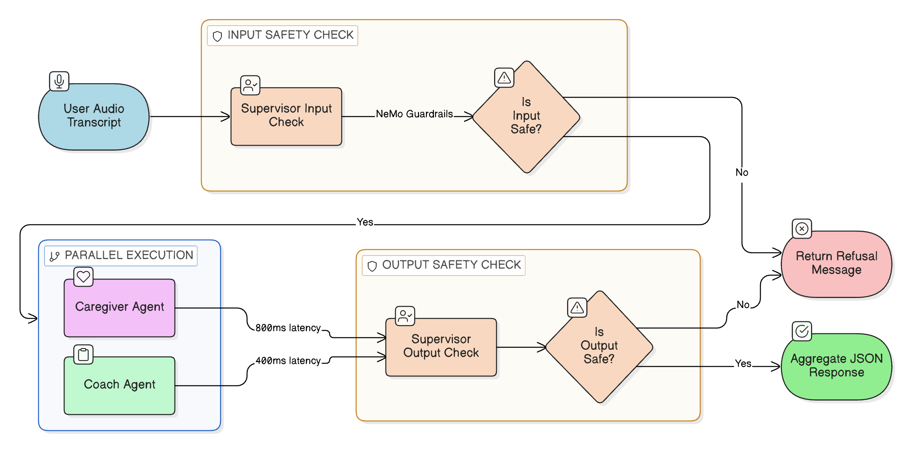
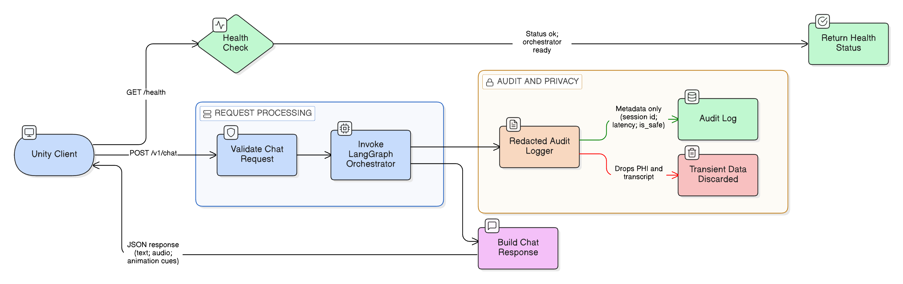

# H4_Nemo_Testing_Security

> Auto-generated markdown counterpart from notebook cells.

# H4 NeMo Testing Security

This notebook consolidates NeMo Guardrails and backend security validation workflows.

## Scope
- Generate guardrails config artifacts (`config.yml`, `topical_rails.co`)
- Run guardrails regression checks (H10)
- Run request schema regression checks (H14)
- Run migrated API auth/audit regression checks from H3
- Run migrated deployment documentation drift checks from H3
- Optional in-process FastAPI orchestrator smoke test

## 5.0 Multi-Agent Orchestration (LangGraph)
Implements the Supervisor-Worker architecture using a state graph.

### 5.1 Multi-Agent Orchestration Logic

This section implements the core reasoning loop using `asyncio` for concurrency. We define three agent classes:
- **Supervisor**: Checks input safety using NeMo Guardrails.
- **Caregiver**: Generates the persona response (simulating RAG+LLM latency).
- **Coach**: Evaluates the turn (simulating C-LEAR rubric latency).

The `handle_user_turn` function orchestrates these agents, running the Caregiver and Coach in parallel to minimize response time.



This diagram maps the core multi-agent state machine. It highlights the two-stage safety checks by the Supervisor and the simultaneous parallel execution of the Caregiver and Coach to meet strict sub-1.5 second latency goals

The core multi-agent backend — a 156-line implementation of the real-time conversation orchestration system. When a caregiver speaks to SPARC-P, the orchestrator decides what happens to their words and who responds.

The four classes defined here, and what each does:

**`SupervisorAgent`**: The safety gatekeeper. Every user message goes through this agent first. It loads the NeMo Guardrails configuration and checks whether the input is on-topic. If it's off-topic or harmful, it returns a pre-set refusal message and sets `is_safe=False`. It also checks the Caregiver's *response* (not just the input) before sending it to the user. The two-stage checking (input + output) prevents both prompt injection and model hallucinations from leaking inappropriate content.

**`CaregiverAgent`**: Simulates 800ms of LLM inference latency (in production, this calls the fine-tuned caregiver model). Returns the avatar's spoken response text.

**`CoachAgent`**: Simulates 400ms of LLM inference latency (in production, this calls the fine-tuned C-LEAR coach model). Returns structured feedback on the trainee's communication.

**`handle_user_turn()`**: The orchestration function that sequences the above agents:
1. Supervisor checks input (if unsafe → return refusal immediately)
2. Caregiver and Coach run **simultaneously** using `asyncio.gather()` — this parallel execution is critical for keeping response time under 1.5 seconds even though two LLMs are involved
3. Supervisor checks the combined output (second safety pass)

**`AsyncOrchestrationGraph`**: A thin adapter class that wraps `handle_user_turn()` with an `ainvoke(state)` interface. This makes it compatible with the FastAPI endpoint in Section 6 without requiring LangGraph compilation.

**`build_app_graph()`**: The factory function called at startup by the FastAPI application to create the orchestrator instance.

```python
import asyncio
import base64
import os
from typing import Any, Dict, Optional
from nemoguardrails import LLMRails, RailsConfig

# 3.3 Multi-Agent System (MAS) Orchestration Logic

class SupervisorAgent:
    def __init__(self, rails_path: str = None):
        self.refusal_message = "I can only discuss topics related to HPV vaccination and clinical communication training."
        base_path = os.environ.get("SPARC_BASE_PATH", "/blue/jasondeanarnold/SPARCP")
        self.rails_path = rails_path or os.environ.get("SPARC_GUARDRAILS_DIR", os.path.join(base_path, "guardrails"))
        self.rails = None
        try:
            rails_config = RailsConfig.from_path(self.rails_path)
            self.rails = LLMRails(rails_config)
            self.guardrails_ready = True
        except Exception as rails_error:
            print(f"SUPERVISOR: Failed to load guardrails from {self.rails_path}: {rails_error}")
            self.guardrails_ready = False

    async def _run_rails(self, user_text: str) -> str:
        if not self.rails:
            raise RuntimeError("Guardrails runtime is not initialized")
        messages = [{"role": "user", "content": user_text}]
        if hasattr(self.rails, "generate_async"):
            result = await self.rails.generate_async(messages=messages)
        else:
            result = self.rails.generate(messages=messages)

        if isinstance(result, dict):
            if "content" in result:
                return str(result["content"])
            return str(result)
        return str(result)

    async def process_input(self, text: str):
        print(f"SUPERVISOR: Checking input '{text}'")
        if not text or not text.strip():
            return self.refusal_message, False, "empty_input"
        if not self.guardrails_ready:
            return self.refusal_message, False, "guardrails_unavailable"

        try:
            rails_output = await self._run_rails(text)
            refusal_detected = self.refusal_message.lower() in rails_output.lower()
            if refusal_detected:
                return self.refusal_message, False, "input_rails_blocked"
            return text, True, "input_rails_allowed"
        except Exception as rails_error:
            print(f"SUPERVISOR: Guardrails input evaluation failed: {rails_error}")
            return self.refusal_message, False, "input_rails_error"

    async def enforce_output(self, text: str):
        if not text or not text.strip():
            return self.refusal_message, False, "empty_output"
        if not self.guardrails_ready:
            return self.refusal_message, False, "guardrails_unavailable"

        try:
            rails_output = await self._run_rails(text)
            refusal_detected = self.refusal_message.lower() in rails_output.lower()
            if refusal_detected:
                return self.refusal_message, False, "output_rails_blocked"
            return text, True, "output_rails_allowed"
        except Exception as rails_error:
            print(f"SUPERVISOR: Guardrails output evaluation failed: {rails_error}")
            return self.refusal_message, False, "output_rails_error"


class CaregiverAgent:
    async def generate_response(self, text: str):
        await asyncio.sleep(0.8)
        return f"Caregiver response to: {text}"


class CoachAgent:
    """
    Evaluates the trainee's conversational turn and optionally synthesizes
    feedback audio using zero-shot voice cloning via Riva TTS.

    When a CoachVoiceConfig is provided and Riva is reachable, evaluate_turn()
    returns (feedback_text, base64_audio_wav).  When voice cloning is not
    configured or Riva is unavailable, it returns (feedback_text, ""),
    and the orchestrator continues normally with text-only feedback.
    """

    def __init__(self, voice_config: Optional["CoachVoiceConfig"] = None):
        self.voice_config = voice_config
        self._riva_channel = None
        self._tts_service = None

        if voice_config and voice_config.is_ready():
            try:
                import riva.client
                self._riva_channel = riva.client.connect(voice_config.riva_server)
                self._tts_service = riva.client.SpeechSynthesisService(self._riva_channel)
                print(f"COACH: Zero-shot TTS ready — prompt: {voice_config.prompt_path.name}")
            except Exception as err:
                print(f"COACH: Riva TTS unavailable ({err}) — text-only fallback active.")
                self._tts_service = None

    async def _synthesize_feedback(self, feedback_text: str) -> str:
        """
        Calls Riva zero-shot TTS synchronously (in a thread executor to avoid
        blocking the async event loop) and returns base64-encoded WAV audio.
        Returns empty string on any error.
        """
        if not self._tts_service or not self.voice_config:
            return ""

        def _call_riva():
            return self._tts_service.synthesize(
                feedback_text,
                self.voice_config.voice_name,
                self.voice_config.language_code,
                sample_rate_hz=44100,
                zero_shot_audio_prompt_file=self.voice_config.prompt_path,
                zero_shot_quality=self.voice_config.quality,
                zero_shot_transcript=self.voice_config.transcript,
            )

        try:
            loop = asyncio.get_event_loop()
            resp = await loop.run_in_executor(None, _call_riva)
            return base64.b64encode(resp.audio).decode("utf-8")
        except Exception as tts_err:
            print(f"COACH TTS synthesis failed: {tts_err}")
            return ""

    async def evaluate_turn(self, text: str):
        await asyncio.sleep(0.4)
        feedback_text = "Good empathy."
        audio_b64 = await self._synthesize_feedback(feedback_text)
        return feedback_text, audio_b64


async def handle_user_turn(user_transcript: str, supervisor, caregiver, coach):
    sanitized_text, is_safe, safety_reason = await supervisor.process_input(user_transcript)
    if not is_safe:
        return {
            "final_text": sanitized_text,
            "coach_feedback": "",
            "coach_audio": "",
            "safety": {"is_safe": False, "reason": safety_reason},
        }

    caregiver_task = asyncio.create_task(caregiver.generate_response(sanitized_text))
    coach_task = asyncio.create_task(coach.evaluate_turn(sanitized_text))
    caregiver_response, (coach_feedback, coach_audio) = await asyncio.gather(caregiver_task, coach_task)

    final_response = f"{caregiver_response} [Feedback: {coach_feedback}]"
    output_text, output_safe, output_reason = await supervisor.enforce_output(final_response)
    return {
        "final_text": output_text,
        "coach_feedback": coach_feedback if output_safe else "",
        "coach_audio": coach_audio if output_safe else "",
        "safety": {"is_safe": output_safe, "reason": output_reason},
    }


class AsyncOrchestrationGraph:
    """
    Minimal async graph adapter to provide an app_graph.ainvoke(...) interface.
    This preserves a clear initialization lifecycle without requiring notebook-wide
    LangGraph compilation for the prototype.
    """

    def __init__(self, supervisor: SupervisorAgent, caregiver: CaregiverAgent, coach: CoachAgent):
        self.supervisor = supervisor
        self.caregiver = caregiver
        self.coach = coach

    async def ainvoke(self, state: Dict[str, Any]) -> Dict[str, Any]:
        transcript = state.get("transcript", "")
        if not isinstance(transcript, str) or not transcript.strip():
            return {
                "final_response": {"text": "No transcript provided.", "audio": "", "cues": {}},
                "feedback": "",
                "coach_audio": "",
                "safety": {"is_safe": False, "reason": "empty_transcript"},
            }

        turn_result = await handle_user_turn(
            transcript,
            self.supervisor,
            self.caregiver,
            self.coach,
        )

        caregiver_text = turn_result.get("final_text", "Error")
        coach_feedback = turn_result.get("coach_feedback", "")
        coach_audio = turn_result.get("coach_audio", "")
        safety = turn_result.get("safety", {"is_safe": False, "reason": "unknown"})

        if " [Feedback: " in caregiver_text and caregiver_text.endswith("]"):
            caregiver_text, feedback_tail = caregiver_text.rsplit(" [Feedback: ", 1)
            coach_feedback = feedback_tail[:-1]

        return {
            "final_response": {
                "text": caregiver_text,
                "audio": "",
                "cues": {"gesture": "speaking"},
            },
            "feedback": coach_feedback,
            "coach_audio": coach_audio,
            "safety": safety,
        }


def build_app_graph() -> AsyncOrchestrationGraph:
    """
    Canonical orchestrator construction lifecycle for the backend endpoint.
    Attempts to load CoachVoiceConfig from audio/coach_examples/processed/best_prompt.wav.
    If the prompt does not exist, CoachAgent starts with voice cloning disabled (text-only).
    """
    supervisor = SupervisorAgent()
    caregiver = CaregiverAgent()

    # Load zero-shot voice config — safe to call even before Section 4.1 has been run.
    # COACH_PROMPT_TRANSCRIPT is set in Section 4.1; falls back to "" gracefully.
    _prompt_transcript = globals().get("COACH_PROMPT_TRANSCRIPT", "")
    voice_cfg = load_coach_voice_config(transcript=_prompt_transcript)
    coach = CoachAgent(voice_config=voice_cfg)

    return AsyncOrchestrationGraph(supervisor, caregiver, coach)

# Example Run
# app_graph = build_app_graph()
# asyncio.run(app_graph.ainvoke({"transcript": "User said something about vaccines"}))
```

## 6.0 API Server (FastAPI)
Exposes the Orchestrator to the Unity Client.

### 6.1 FastAPI Server Implementation

The orchestration logic is wrapped in a **FastAPI** application to expose it to the Unity client.
- **`/v1/chat` Endpoint**: Accepts a user transcript and session ID, invokes the orchestration loop, and returns the multi-agent response (Text, Audio, Feedback).
- **Redacted Audit Logging**: Writes only compliant metadata (`session_id`, `agent_type`, `is_safe`, `latency_ms`, timestamp) and excludes raw transcript content.
- **Health Check**: A simple `GET /health` endpoint for monitoring service uptime and audit retention metadata.



This flowchart illustrates the HTTP boundary exposed to the Unity client. It specifically outlines the HIPAA "transient PHI" model, showing that while requests are processed, no personal health information or transcript data is written to disk.

The complete production FastAPI web server — the HTTP interface that the Unity-based SPARC-P client calls to interact with the AI agents — is defined here. The application object (`app`) and its endpoints are registered; the server does not start serving until `uvicorn.run(app, ...)` is called (which happens in the SLURM launch script).

What the server contains:

**Configuration & audit logging setup:**
- Reads `SPARC_BASE_PATH` and `SPARC_AUDIT_LOG` from environment variables, defaulting to `/blue/`.
- Calls `validate_audit_log_path()` at startup to ensure the log directory exists and is writable — failing loudly if not, so audit compliance issues are caught before the first API call.
- `log_redacted_audit_event()` writes only compliant metadata to the audit log: session ID, agent type, whether the message was safe, response latency, and a UTC timestamp. **No transcript text or PHI is written** — this is the HIPAA "transient PHI" model.

**Request/response models (Pydantic):**
- `ChatRequest`: Validates that `session_id` is 1–128 characters of alphanumerics/hyphens/underscores (preventing injection via session IDs) and `user_transcript` is 1–10,000 characters.
- `ChatResponse`: The structured response containing the caregiver's text, audio (Base64), animation cues, and coach feedback.

**`GET /health`** — Returns service status, whether the orchestrator is ready, and audit retention metadata. Used by monitoring systems to detect if the service is degraded.

**`POST /v1/chat`** — The primary endpoint:
1. Validates the request schema
2. Calls `app_graph.ainvoke()` with the transcript and timing context
3. Logs a redacted audit event
4. Returns the `ChatResponse` with caregiver text, audio, cues, and feedback

> **Thread safety note:** `app_graph` is set to `None` if `build_app_graph()` fails at startup. The `/v1/chat` endpoint checks for this and returns HTTP 503 (Service Unavailable) immediately, preventing any request from reaching an uninitialized orchestrator.

```python
from fastapi import Depends, FastAPI, Header, HTTPException
from pydantic import BaseModel, Field
import uvicorn
import logging
import os
import json
import time
from datetime import datetime, timezone
from typing import Optional

app = FastAPI()

# 6.1 Configuration & Logging
BASE_PATH = os.environ.get("SPARC_BASE_PATH", "/blue/jasondeanarnold/SPARCP")
LOG_FILE = os.environ.get("SPARC_AUDIT_LOG", os.path.join(BASE_PATH, "logs", "audit.log"))
AUDIT_RETENTION_DAYS = int(os.environ.get("SPARC_AUDIT_RETENTION_DAYS", "30"))
LOG_DIR = os.path.dirname(LOG_FILE) or "."

def validate_audit_log_path(log_file: str) -> None:
    log_dir = os.path.dirname(log_file) or "."
    os.makedirs(log_dir, exist_ok=True)
    if not os.access(log_dir, os.W_OK):
        raise PermissionError(f"Audit log directory is not writable: {log_dir}")
    with open(log_file, "a", encoding="utf-8"):
        pass

validate_audit_log_path(LOG_FILE)
logging.basicConfig(filename=LOG_FILE, level=logging.INFO, format='%(asctime)s - %(message)s')

app_graph = None

# API Authentication (defense in depth)
API_AUTH_ENABLED = os.environ.get("SPARC_API_AUTH_ENABLED", "true").strip().lower() == "true"
API_KEY = os.environ.get("SPARC_API_KEY", "")


def require_api_key(x_api_key: Optional[str] = Header(default=None, alias="X-API-Key")) -> str:
    if not API_AUTH_ENABLED:
        return "auth_disabled"
    if not API_KEY:
        raise HTTPException(
            status_code=503,
            detail="API key auth is enabled but SPARC_API_KEY is not configured",
        )
    if x_api_key != API_KEY:
        raise HTTPException(status_code=401, detail="Invalid or missing API key")
    return x_api_key


def log_redacted_audit_event(session_id: str, agent_type: str, is_safe: bool, latency_ms: float):
    event = {
        "event": "chat_turn",
        "event_ts": datetime.now(timezone.utc).isoformat(),
        "session_id": session_id,
        "agent_type": agent_type,
        "is_safe": is_safe,
        "latency_ms": round(latency_ms, 2),
        "retention_days": AUDIT_RETENTION_DAYS,
    }
    logging.info(json.dumps(event, sort_keys=True))


def initialize_orchestrator():
    """Build and inject the orchestrator graph once at startup/init time."""
    global app_graph
    try:
        app_graph = build_app_graph()
    except Exception as exc:
        app_graph = None
        logging.error(f"Failed to initialize orchestrator graph: {exc}")

initialize_orchestrator()


class ChatRequest(BaseModel):
    session_id: str = Field(..., min_length=1, max_length=128, pattern=r"^[a-zA-Z0-9_-]+$")
    user_transcript: str = Field(..., min_length=1, max_length=10000)


class ChatResponse(BaseModel):
    caregiver_text: str
    caregiver_audio_b64: str
    coach_feedback: str


# 6.2 Endpoints
@app.get("/health")
async def health_check():
    orchestrator_ready = app_graph is not None and hasattr(app_graph, "ainvoke")
    return {
        "status": "ok" if orchestrator_ready else "degraded",
        "service": "SPARC-P Backend",
        "orchestrator_ready": orchestrator_ready,
        "audit_log_path": LOG_FILE,
        "audit_retention_days": AUDIT_RETENTION_DAYS,
    }


@app.post("/v1/chat", response_model=ChatResponse)
async def chat_endpoint(request: ChatRequest, _api_key: str = Depends(require_api_key)):
    # Fail-fast for uninitialized orchestration
    if app_graph is None or not hasattr(app_graph, "ainvoke"):
        raise HTTPException(status_code=503, detail="Orchestrator is not initialized")

    # Invoke orchestrator
    start_time = time.perf_counter()
    initial_state = {
        "transcript": request.user_transcript,
        "history": [],
        "feedback": "",
        "next_action": "",
        "final_response": {},
    }
    try:
        result = await app_graph.ainvoke(initial_state)
        latency_ms = (time.perf_counter() - start_time) * 1000

        response_data = result.get("final_response", {})
        caregiver_text = response_data.get("text", "Error")

        # Redacted audit log only (no raw transcript / PHI content)
        safety_result = result.get("safety", {})
        is_safe = bool(safety_result.get("is_safe", False))
        log_redacted_audit_event(
            session_id=request.session_id,
            agent_type="orchestrator",
            is_safe=is_safe,
            latency_ms=latency_ms,
        )

        return ChatResponse(
            caregiver_text=caregiver_text,
            caregiver_audio_b64=response_data.get("audio", ""),
            coach_feedback=result.get("feedback", ""),
        )
    except HTTPException:
        raise
    except Exception as e:
        logging.exception("/v1/chat failed: %s", str(e))
        raise HTTPException(status_code=500, detail="Internal server error")

# To run:
# uvicorn.run(app, host="0.0.0.0", port=8000)
```

Three automated smoke tests run against the FastAPI application using `TestClient` — a built-in FastAPI/Starlette utility that sends HTTP requests to the app in-memory without needing a running server. All three tests run immediately.

**Test A — Health endpoint:**
- Sends `GET /health` and prints the response. Expected: `{"status": "ok", "orchestrator_ready": true, ...}` if the orchestrator initialized successfully.

**Test B — Successful chat request:**
- Sends a valid `POST /v1/chat` request with a proper `session_id` and an on-topic HPV vaccine question.
- Expected: HTTP 200 with a `ChatResponse` JSON body containing `caregiver_text`, `coach_feedback`, etc.

**Test C — Degraded service (orchestrator unavailable):**
- Saves the current `app_graph`, sets it to `None` to simulate a startup failure, sends the same chat request, then restores `app_graph`.
- Expected: HTTP 503 with a `"Orchestrator is not initialized"` detail message.
- **Restores `app_graph` afterward** so subsequent cells still work correctly.

> **If Test B fails with 503 when it should pass:** The orchestrator failed to initialize (likely because NeMo Guardrails couldn't load its config files). Check that `create_rails_config()` was run first (Section 3.2) and that the guardrails directory path is correct.

```python
# 6.3 Orchestrator Smoke Tests (FastAPI TestClient)
from fastapi.testclient import TestClient

client = TestClient(app)

# A) Health endpoint should reflect orchestrator readiness
health = client.get("/health")
print("Health:", health.status_code, health.json())

# B) Chat endpoint should succeed when orchestrator is initialized
ok_payload = {"session_id": "smoke-session", "user_transcript": "Can you help me talk about HPV vaccines?"}
ok_response = client.post("/v1/chat", json=ok_payload)
print("Chat (ready):", ok_response.status_code, ok_response.json())

# C) Chat endpoint should fail-fast when orchestrator is unavailable
saved_graph = app_graph
app_graph = None
degraded_response = client.post("/v1/chat", json=ok_payload)
print("Chat (degraded):", degraded_response.status_code, degraded_response.json())

# Restore state for subsequent cells
app_graph = saved_graph
```

This is the **H10 guardrails regression check** — it reads the companion markdown file (`3_SPARC_RIVA_Backend.md`) and verifies that the critical NeMo Guardrails integration code patterns are documented there, and that a specific dangerous legacy pattern (keyword-only safety checking) is not present.

What it checks:
- **7 required markers** must be present in the documentation, including the NeMo import line, the `SPARC_GUARDRAILS_DIR` environment variable name, the `RailsConfig.from_path()` call, and the `enforce_output` method. These verify that the full runtime guardrails path (not a shortcut) is implemented and documented.
- **2 blocked patterns** must NOT appear:
  - `is_safe = "politics" not in text.lower()` — a fragile keyword-based safety check from an earlier version. This approach was replaced by NeMo Guardrails because keyword matching is trivially circumvented (e.g., "pol1tics") and doesn't understand context.
  - A commented-out NeMo import — which would indicate the guardrails code was disabled rather than removed.

> **Why this check exists:** Earlier versions of this notebook used simple keyword matching for safety. This regression check ensures that if someone edits the notebook and reverts to the simpler approach for debugging, the CI-style assertion will block them from committing that regression to documentation.
