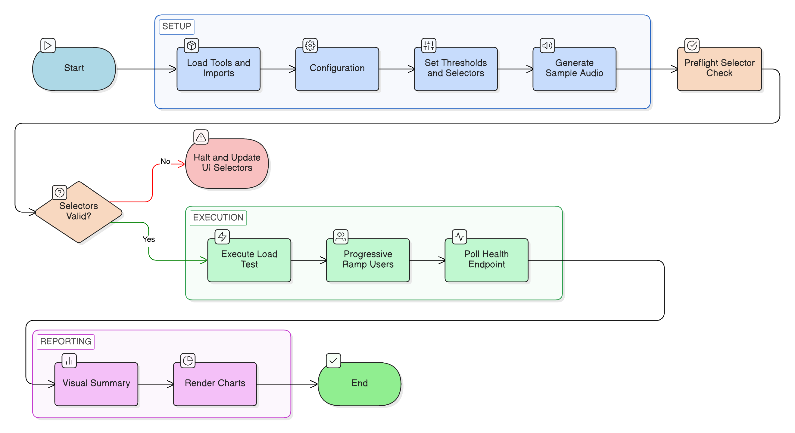
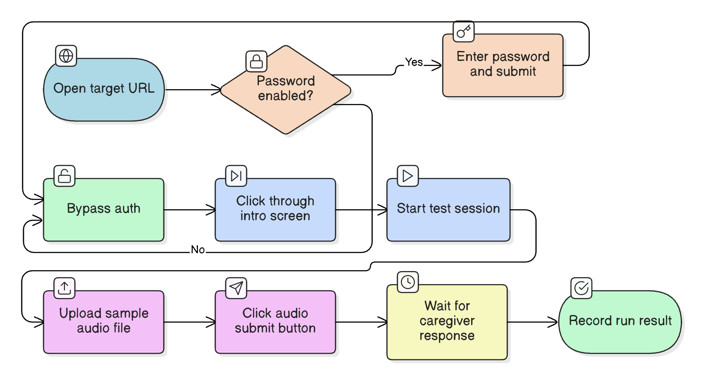
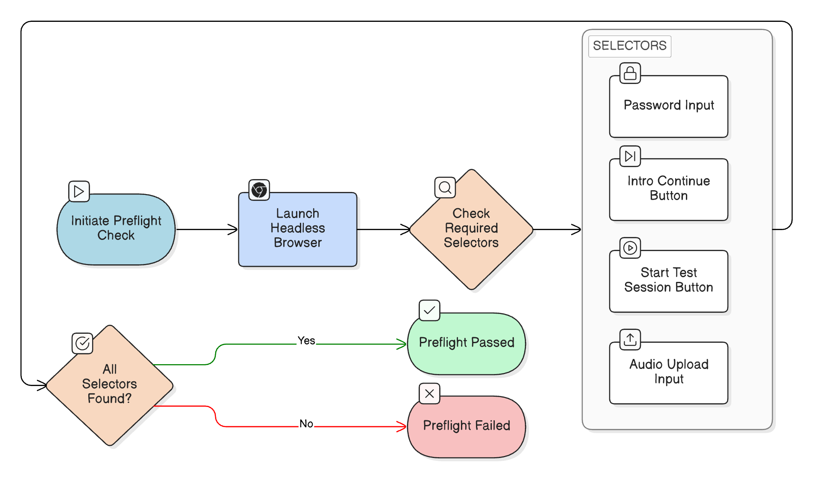
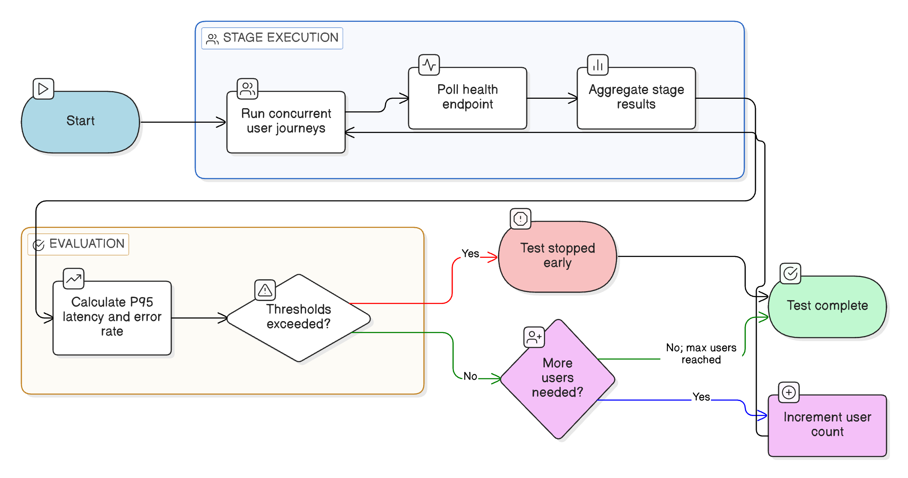
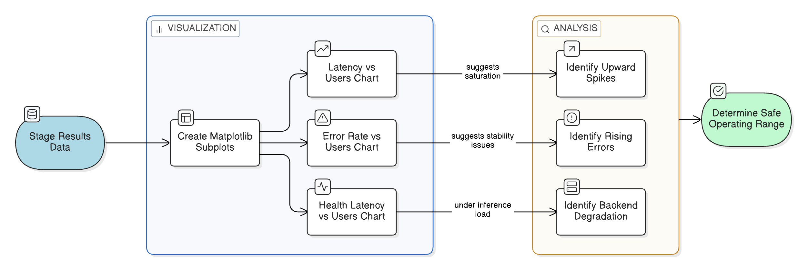

# P3_PubApp_Load_Testing

> Auto-generated markdown counterpart from notebook cells.

# P3 PubApp Load Testing

This notebook checks how well the PubApp handles more people using it at the same time.

You do **not** need to be technical to use this notebook. Each step below explains exactly what is happening and what to look for.

## What this notebook simulates
- A real person opens the website
- Enters the password (if enabled)
- Clicks through the intro
- Starts **Test Session 1**
- Uploads a short sample audio file
- Waits for the app's caregiver response



P3 Overall Notebook Execution Workflow: This flowchart outlines the recommended top-to-bottom execution sequence of the notebook, moving from initialization and configuration through preflight safety checks, the main progressive load test, and final visualization

## Goal for this run
- Increase traffic gradually from **1 to 10 users**
- Stop early if performance becomes unhealthy (high delay or high errors)

## Recommended order
1. Run **Cell 2** (loads tools)
2. Run **Cell 4** (configuration)
3. Run **Cell 8** (preflight selector check)
4. Run **Cell 10** (load test)
5. Run **Cell 12** (charts)

If a step fails, the notebook tells you what to adjust next.

```python
import os
import io
import wave
import math
import asyncio
import statistics
from dataclasses import dataclass
from pathlib import Path
from time import perf_counter
from typing import Dict, Any, List, Optional

import pandas as pd
import matplotlib.pyplot as plt
from IPython.display import display, clear_output

try:
    from playwright.async_api import async_playwright
except Exception as exc:
    raise RuntimeError(
        "Playwright is missing in this environment. Use conda-based setup: update/create env from environment_training.yml or environment_backend.yml, then run setup_conda_env.sh to install Chromium runtime."
    ) from exc

print("✅ Imports loaded")
```

## Configuration (setup step)

This step sets the main test settings before anything runs.

### What you are setting
- Website address to test
- Password (if your site is protected)
- How many users to ramp from/to
- What counts as a problem (latency or errors)
- Button and input selectors the browser automation will click

### What to do
- Keep defaults for a first run
- Update the `SELECTORS` values to match your current UI labels/buttons
- Optionally set `PUBAPP_PASSWORD` in environment variables instead of hardcoding

### Success signal
After this cell runs, you should see confirmation that a sample audio file was created.

```python
BASE_URL = "https://hpvcommunicationtraining.org"
APP_PASSWORD = os.environ.get("PUBAPP_PASSWORD", "")

# Progressive load profile
START_USERS = 1
MAX_USERS = 10
USER_STEP = 1

# Limit thresholds (stop when either is breached)
P95_LATENCY_LIMIT_S = 8.0
ERROR_RATE_LIMIT_PCT = 10.0

# Timing controls
PAGE_TIMEOUT_MS = 30000
STEP_PAUSE_S = 0.5
HEADLESS = True

# Optional endpoint to measure backend health latency per stage
HEALTHCHECK_URL = os.environ.get("PUBAPP_HEALTHCHECK_URL", "")

# Update selectors to match your live React/Unity WebGL UI
SELECTORS = {
    "password_input": "input[type='password']",
    "password_submit": "button:has-text('Enter')",
    "intro_continue": "button:has-text('Continue')",
    "begin_session_1": "button:has-text('Begin Test Session 1')",
    "audio_file_input": "input[type='file']",
    "audio_submit": "button:has-text('Send')",
    "caregiver_response_marker": "text=Anne",
}

SAMPLE_TEXT = "Hello Anne thank you for bringing Riley today"
SAMPLE_AUDIO_PATH = Path("p3_sample_audio.wav")


def generate_sample_wav(path: Path, seconds: float = 2.0, sample_rate: int = 16000):
    freq = 440.0
    amplitude = 12000
    n_samples = int(seconds * sample_rate)

    with wave.open(str(path), "wb") as wav_file:
        wav_file.setnchannels(1)
        wav_file.setsampwidth(2)
        wav_file.setframerate(sample_rate)
        frames = bytearray()
        for i in range(n_samples):
            value = int(amplitude * math.sin(2 * math.pi * freq * (i / sample_rate)))
            frames += value.to_bytes(2, byteorder="little", signed=True)
        wav_file.writeframes(bytes(frames))


generate_sample_wav(SAMPLE_AUDIO_PATH)
print(f"✅ Sample audio generated: {SAMPLE_AUDIO_PATH.resolve()}")
```

## Load test engine (internal logic)

This step defines the reusable test logic. It does **not** run the full load test yet.

### What this logic does behind the scenes
- Runs one complete user journey in a browser
- Repeats that journey for multiple concurrent users
- Measures speed and failures at each load level
- Stops automatically when thresholds are exceeded



The Simulated User Journey: This diagram details the exact sequence of browser automation actions executed by the test engine for each simulated concurrent user during a test stage

### Why this matters
Think of this as preparing the "test machine." Once this cell runs, the notebook is ready to execute the real test safely and consistently.

### Success signal
No output table is expected yet; the cell should complete without errors.

```python
@dataclass
class UserRunResult:
    user_id: int
    success: bool
    total_s: float
    error: str
    step_times: Dict[str, float]


async def _safe_click(page, selector: str, step_name: str, step_times: Dict[str, float]):
    start = perf_counter()
    await page.click(selector, timeout=PAGE_TIMEOUT_MS)
    step_times[step_name] = perf_counter() - start


async def run_user_journey(user_id: int, browser, config: Dict[str, Any]) -> UserRunResult:
    t0 = perf_counter()
    step_times: Dict[str, float] = {}
    context = await browser.new_context()
    page = await context.new_page()

    try:
        start = perf_counter()
        await page.goto(config["base_url"], timeout=PAGE_TIMEOUT_MS)
        step_times["open_site"] = perf_counter() - start

        if config["password"]:
            start = perf_counter()
            await page.fill(config["selectors"]["password_input"], config["password"], timeout=PAGE_TIMEOUT_MS)
            await page.click(config["selectors"]["password_submit"], timeout=PAGE_TIMEOUT_MS)
            step_times["password_gate"] = perf_counter() - start

        if config["selectors"].get("intro_continue"):
            try:
                await _safe_click(page, config["selectors"]["intro_continue"], "intro_continue", step_times)
            except Exception:
                pass

        await _safe_click(page, config["selectors"]["begin_session_1"], "begin_session_1", step_times)
        await asyncio.sleep(config["step_pause_s"])

        start = perf_counter()
        await page.set_input_files(config["selectors"]["audio_file_input"], str(config["sample_audio_path"]))
        step_times["upload_audio"] = perf_counter() - start

        if config["selectors"].get("audio_submit"):
            await _safe_click(page, config["selectors"]["audio_submit"], "audio_submit", step_times)

        marker = config["selectors"].get("caregiver_response_marker")
        if marker:
            start = perf_counter()
            await page.wait_for_selector(marker, timeout=PAGE_TIMEOUT_MS)
            step_times["wait_response"] = perf_counter() - start

        total_s = perf_counter() - t0
        await context.close()
        return UserRunResult(user_id=user_id, success=True, total_s=total_s, error="", step_times=step_times)

    except Exception as exc:
        total_s = perf_counter() - t0
        await context.close()
        return UserRunResult(user_id=user_id, success=False, total_s=total_s, error=str(exc), step_times=step_times)


async def measure_health_latency(url: str) -> Optional[float]:
    if not url:
        return None
    try:
        import aiohttp
        t0 = perf_counter()
        async with aiohttp.ClientSession() as session:
            async with session.get(url, timeout=10) as _:
                pass
        return perf_counter() - t0
    except Exception:
        return None


def aggregate_stage(stage_users: int, runs: List[UserRunResult], health_latency_s: Optional[float]) -> Dict[str, Any]:
    successes = [r for r in runs if r.success]
    failures = [r for r in runs if not r.success]
    latencies = [r.total_s for r in successes]

    p50 = statistics.median(latencies) if latencies else None
    p95 = None
    if latencies:
        sorted_lats = sorted(latencies)
        idx = max(0, int(0.95 * len(sorted_lats)) - 1)
        p95 = sorted_lats[idx]

    error_rate_pct = (len(failures) / len(runs) * 100.0) if runs else 0.0

    return {
        "users": stage_users,
        "runs": len(runs),
        "successes": len(successes),
        "failures": len(failures),
        "error_rate_pct": round(error_rate_pct, 2),
        "avg_latency_s": round(sum(latencies) / len(latencies), 3) if latencies else None,
        "p50_latency_s": round(p50, 3) if p50 is not None else None,
        "p95_latency_s": round(p95, 3) if p95 is not None else None,
        "health_latency_s": round(health_latency_s, 3) if health_latency_s is not None else None,
    }


async def run_progressive_load_test(config: Dict[str, Any]) -> (pd.DataFrame, pd.DataFrame):
    stage_rows: List[Dict[str, Any]] = []
    detail_rows: List[Dict[str, Any]] = []

    async with async_playwright() as p:
        browser = await p.chromium.launch(headless=config["headless"])

        for stage_users in range(config["start_users"], config["max_users"] + 1, config["user_step"]):
            tasks = [run_user_journey(i + 1, browser, config) for i in range(stage_users)]
            stage_runs = await asyncio.gather(*tasks)
            health_latency_s = await measure_health_latency(config.get("healthcheck_url", ""))

            stage_metrics = aggregate_stage(stage_users, stage_runs, health_latency_s)
            stage_rows.append(stage_metrics)

            for r in stage_runs:
                detail_rows.append({
                    "users_stage": stage_users,
                    "user_id": r.user_id,
                    "success": r.success,
                    "total_s": round(r.total_s, 3),
                    "error": r.error,
                    **{f"step_{k}_s": round(v, 3) for k, v in r.step_times.items()},
                })

            stage_df = pd.DataFrame(stage_rows)
            clear_output(wait=True)
            print("Live stage metrics")
            display(stage_df)

            p95 = stage_metrics.get("p95_latency_s")
            err = stage_metrics.get("error_rate_pct", 0.0)
            if (p95 is not None and p95 > config["p95_latency_limit_s"]) or (err > config["error_rate_limit_pct"]):
                print("\n⚠️ Limit condition reached. Stopping progressive ramp.")
                break

        await browser.close()

    return pd.DataFrame(stage_rows), pd.DataFrame(detail_rows)
```

## Preflight selector smoke test (quick safety check)

Run this before load testing. It verifies the notebook can actually find the right fields and buttons on your live site.



Preflight Selector Smoke Test (Safety Gate): Before subjecting the PubApp to heavy concurrent load, the notebook runs a lightweight preflight check. This diagram models how the test verifies that the automation script can successfully find the live UI elements

### What it checks
- Password input and submit button (when password is used)
- Intro continue button (optional)
- Start Test Session 1 button
- Audio upload input
- Audio submit button (optional)

### How to read results
- **Passed** required checks: safe to continue to the load test
- **Failed** required checks: update `SELECTORS` and run this check again

This prevents long test runs from failing due to simple UI selector mismatches.

```python
async def run_selector_smoke_test(config: Dict[str, Any]) -> pd.DataFrame:
    checks: List[Dict[str, Any]] = []

    def add_check(name: str, required: bool, passed: bool, detail: str = ""):
        checks.append({
            "check": name,
            "required": required,
            "passed": passed,
            "detail": detail,
        })

    async with async_playwright() as p:
        browser = await p.chromium.launch(headless=config["headless"])
        context = await browser.new_context()
        page = await context.new_page()

        try:
            await page.goto(config["base_url"], timeout=PAGE_TIMEOUT_MS)
            selectors = config["selectors"]

            if config["password"]:
                try:
                    await page.wait_for_selector(selectors["password_input"], timeout=PAGE_TIMEOUT_MS)
                    add_check("password_input", True, True)
                except Exception as exc:
                    add_check("password_input", True, False, str(exc))

                try:
                    await page.wait_for_selector(selectors["password_submit"], timeout=PAGE_TIMEOUT_MS)
                    add_check("password_submit", True, True)
                except Exception as exc:
                    add_check("password_submit", True, False, str(exc))
            else:
                add_check("password_input/password_submit", False, True, "Skipped (no password configured)")

            for key, required in [
                ("intro_continue", False),
                ("begin_session_1", True),
                ("audio_file_input", True),
                ("audio_submit", False),
            ]:
                selector = selectors.get(key)
                if not selector:
                    add_check(key, required, not required, "Selector missing from config")
                    continue
                try:
                    await page.wait_for_selector(selector, timeout=PAGE_TIMEOUT_MS)
                    add_check(key, required, True)
                except Exception as exc:
                    add_check(key, required, False if required else True, str(exc) if required else "Optional selector not found")

        finally:
            await context.close()
            await browser.close()

    results_df = pd.DataFrame(checks)
    required_failed = results_df[(results_df["required"] == True) & (results_df["passed"] == False)]

    display(results_df)
    if required_failed.empty:
        print("✅ Preflight passed: all required selectors were found.")
    else:
        print("❌ Preflight failed: required selectors missing. Update SELECTORS before running load tests.")

    return results_df


smoke_df = await run_selector_smoke_test({
    "base_url": BASE_URL,
    "password": APP_PASSWORD,
    "selectors": SELECTORS,
    "headless": HEADLESS,
})
```

## Run test (main execution)

This is the main load test run.



Progressive Load Test Engine & Circuit Breakers: This comprehensive diagram maps the core asynchronous test engine (run_progressive_load_test). It illustrates how traffic scales from 1 to 10 users, runs concurrent user journeys alongside health checks, and evaluates results against strict failure thresholds

### What happens here
- The notebook starts at 1 user and increases up to 10 users
- For each level, all simulated users perform the same journey
- The notebook records latency and error rate
- It stops early if health limits are exceeded

### Built-in safety behavior
- If preflight checks were not run, this step is blocked
- If preflight required checks failed, this step is blocked
- You will get a clear message telling you what to fix

### Output you will see
- A stage summary table (by user count)
- A detailed per-user table
- A clear message showing whether a capacity limit was reached

```python
load_config = {
    "base_url": BASE_URL,
    "password": APP_PASSWORD,
    "selectors": SELECTORS,
    "sample_audio_path": SAMPLE_AUDIO_PATH,
    "headless": HEADLESS,
    "step_pause_s": STEP_PAUSE_S,
    "start_users": START_USERS,
    "max_users": MAX_USERS,
    "user_step": USER_STEP,
    "p95_latency_limit_s": P95_LATENCY_LIMIT_S,
    "error_rate_limit_pct": ERROR_RATE_LIMIT_PCT,
    "healthcheck_url": HEALTHCHECK_URL,
}

preflight_blocked = False
preflight_reason = ""

if "smoke_df" not in globals() or smoke_df is None or not isinstance(smoke_df, pd.DataFrame) or smoke_df.empty:
    preflight_blocked = True
    preflight_reason = "Preflight smoke test results not found. Run the preflight cell first."
else:
    required_failed = smoke_df[(smoke_df["required"] == True) & (smoke_df["passed"] == False)]
    if not required_failed.empty:
        preflight_blocked = True
        failed_checks = ", ".join(required_failed["check"].astype(str).tolist())
        preflight_reason = f"Preflight failed required checks: {failed_checks}"

if preflight_blocked:
    print(f"⛔ Load test blocked: {preflight_reason}")
    print("Fix selectors/configuration and re-run the preflight cell before starting load tests.")
    stage_results_df = pd.DataFrame()
    detail_results_df = pd.DataFrame()
else:
    stage_results_df, detail_results_df = await run_progressive_load_test(load_config)

    print("\nFinal stage metrics")
    display(stage_results_df)

    print("\nPer-user detail sample")
    display(detail_results_df.head(30))

    if not stage_results_df.empty:
        breached = stage_results_df[
            ((stage_results_df["p95_latency_s"].fillna(0) > P95_LATENCY_LIMIT_S) |
             (stage_results_df["error_rate_pct"] > ERROR_RATE_LIMIT_PCT))
        ]
        if not breached.empty:
            first = breached.iloc[0]
            print(f"\nLimit reached at users={int(first['users'])} (p95={first['p95_latency_s']}s, error_rate={first['error_rate_pct']}%).")
        else:
            print("\nNo limit breach observed within configured ramp.")
```

## Visual summary (easy-to-read charts)

This step turns the test results into simple charts so you can see trends quickly.



Visual Summary and Reporting: This flowchart shows how the final execution cell (Cell 12) transforms the collected DataFrames into actionable, easy-to-read charts to help operators determine safe production capacity

### Charts included
- Latency vs number of users
- Error rate vs number of users
- Optional health endpoint latency vs users

### How to interpret quickly
- Upward spikes in latency suggest saturation
- Rising error rate suggests stability issues
- Crossing the threshold lines indicates likely capacity limits

Use these charts to decide a safe operating range for production traffic.

```python
if stage_results_df.empty:
    print("No stage results to plot.")
else:
    fig, axes = plt.subplots(1, 3, figsize=(18, 4))

    axes[0].plot(stage_results_df["users"], stage_results_df["avg_latency_s"], marker="o", label="avg")
    axes[0].plot(stage_results_df["users"], stage_results_df["p95_latency_s"], marker="o", label="p95")
    axes[0].axhline(P95_LATENCY_LIMIT_S, linestyle="--", color="red", label="p95 limit")
    axes[0].set_title("Latency vs Users")
    axes[0].set_xlabel("Concurrent users")
    axes[0].set_ylabel("Seconds")
    axes[0].legend()

    axes[1].plot(stage_results_df["users"], stage_results_df["error_rate_pct"], marker="o", color="orange")
    axes[1].axhline(ERROR_RATE_LIMIT_PCT, linestyle="--", color="red", label="error limit")
    axes[1].set_title("Error Rate vs Users")
    axes[1].set_xlabel("Concurrent users")
    axes[1].set_ylabel("Error rate (%)")
    axes[1].legend()

    if "health_latency_s" in stage_results_df.columns:
        axes[2].plot(stage_results_df["users"], stage_results_df["health_latency_s"], marker="o", color="green")
        axes[2].set_title("Health Endpoint Latency vs Users")
        axes[2].set_xlabel("Concurrent users")
        axes[2].set_ylabel("Seconds")
    else:
        axes[2].set_visible(False)

    plt.tight_layout()
    plt.show()
```
